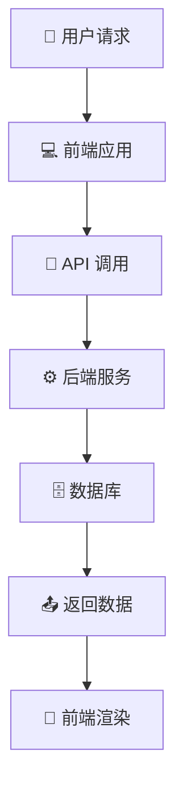
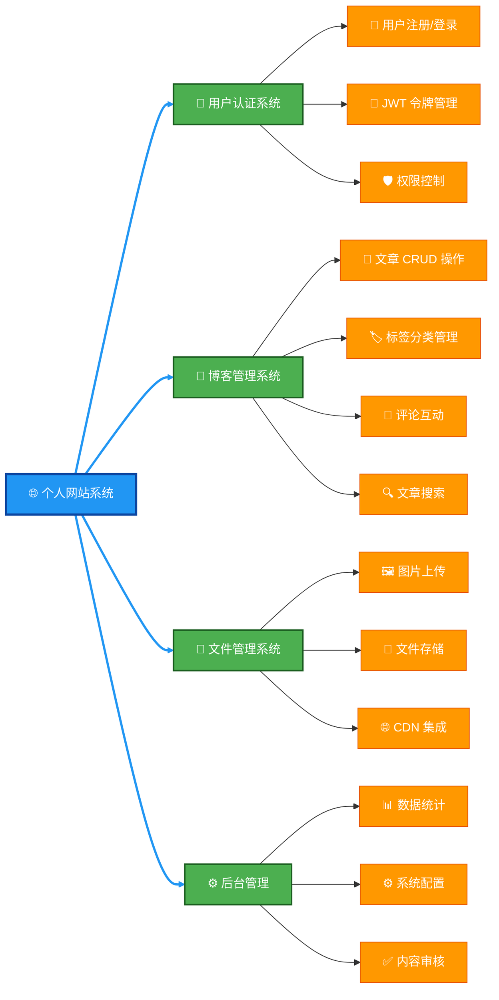
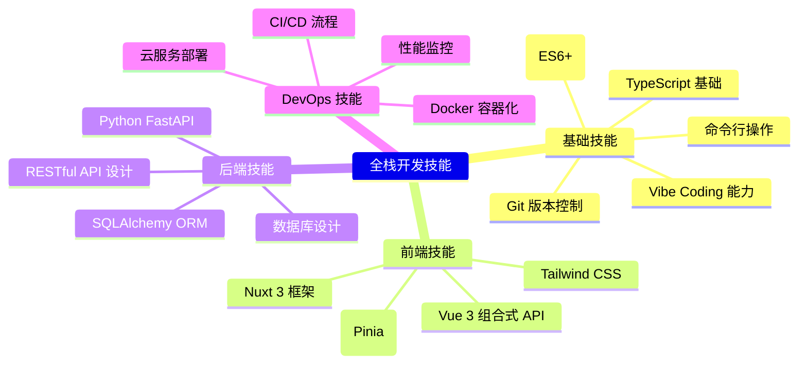

# 第 1 章：全栈开发导论与课程介绍 <Badge type="tip" text="入门" />

欢迎进入全栈开发的世界！这一章将为你打开通往现代 Web 开发的大门，让我们一起探索全栈开发的精髓与核心概念。

::: tip 提示
本章将介绍前后端分离架构、技术栈选择和项目规划，为你打下全栈开发的基础。
:::

---

## 1.1 什么是前后端分离架构 <Badge type="info" text="架构基础" />

### 定义与概念

前后端分离架构是一种现代 Web 开发模式，将用户界面和业务逻辑分离为两个独立的系统：

- 前端负责 UI 渲染、用户交互和数据展示
- 后端专注于数据处理、业务逻辑和 API 提供
- 前后端通过 RESTful API 或 GraphQL 进行数据通信

::: note 关键特点
前后端分离实现了关注点分离，使开发更加模块化，便于团队协作和系统维护。
:::

### 架构优势

前后端分离架构在现代 Web 开发中广受欢迎，主要得益于以下优势：

- **开发效率**：前后端团队可以并行工作，互不阻塞
- **技术栈灵活**：前端和后端可以各自选择最适合的技术栈
- **易于维护**：职责单一明确，代码模块化
- **扩展性强**：同一套后端 API 可服务于多种前端应用（网站、App、平板等）

::: tip 性能提升
前后端分离还能带来性能优势，通过 API 缓存、按需加载等方式优化用户体验。
:::

### 技术实现流程



---

## 1.2 Nuxt.js 与 FastAPI 技术栈优势 <Badge type="warning" text="技术选择" />

### Nuxt.js 核心优势

Nuxt.js 是基于 Vue 3 的全栈框架，具备以下核心优势：

- **全栈能力**：支持服务端渲染 (SSR)、静态站点生成 (SSG)，兼顾 SEO 和用户体验
- **开发体验**：文件系统路由、自动导入、热更新，大幅提升开发效率
- **性能优化**：自动代码分割、智能预加载、图片优化，优化页面加载速度
- **TypeScript 支持**：完整的 TS 类型支持，提升代码质量和可维护性

```typescript
// Nuxt.js 自动导入示例
const { data } = await useFetch('/api/users')
```

### FastAPI 技术亮点

FastAPI 是现代化的 Python Web 框架，具有以下突出特点：

- **高性能**：基于 Starlette 和 Pydantic，性能接近 Node.js 和 Go
- **开发效率**：自动 API 文档、类型注解、编辑器支持，简化开发流程
- **现代标准**：完全支持异步编程、OpenAPI、JSON Schema
- **安全性**：内置数据验证、序列化、身份验证机制

```python
# FastAPI 类型安全示例
@app.get("/items/{item_id}")
async def read_item(item_id: int, q: str = None) -> Item:
    return {"item_id": item_id, "q": q}
```

### 技术栈协同优势

Nuxt.js 与 FastAPI 的组合实现了前后端的无缝协作：

```python
# FastAPI 提供类型安全的 API
@app.get("/articles/{article_id}")
async def read_article(article_id: int) -> ArticleSchema:
    return await get_article(article_id)
```

```typescript
// Nuxt.js 享受类型安全的 API 调用
const { data: article } = await useFetch<Article>('/api/articles/1')
```

::: important 协同价值
这种类型安全的协作方式实现了前后端的无缝对接，减少沟通成本和潜在错误，提高开发效率。
:::

---

## 1.3 个人网站项目功能规划 <Badge type="danger" text="项目设计" />

### 核心功能模块



### 技术特性规划

我们的个人网站将具备现代 Web 应用的核心特性：

- **响应式设计**：支持 PC 和移动端访问
- **SEO 优化**：通过服务端渲染提升搜索引擎收录效果
- **实时搜索和过滤**：提供高效的内容查找体验
- **主题切换**：支持明暗模式，提升用户体验
- **国际化支持**：多语言功能，服务全球用户

::: demo-wrapper title="响应式设计示例" no-padding
```css
/* 响应式设计示例 */
.container {
  max-width: 1200px;
  margin: 0 auto;
}

@media (max-width: 768px) {
  .container {
    padding: 0 1rem;
  }
}
```
:::

---

## 1.4 学习目标与预期成果 <Badge type="tip" text="学习路径" />

### 技术能力目标

通过本课程的学习，你将获得全栈开发的核心能力：

- 掌握全栈开发完整流程
- 熟练使用 Vue 3 + Nuxt 3 开发现代 Web 应用
- 掌握 FastAPI 构建高性能后端 API
- 理解前后端分离架构设计思想
- 具备独立部署和维护全栈项目能力

::: warning 学习建议
实践是掌握全栈开发的关键，建议跟随课程进度完成每个实践环节。
:::

### 项目成果

完成本课程后，你将获得以下成果：

- **完整的个人网站项目源码**：可作为你的数字作品集
- **生产环境部署配置**：实现项目上线运行
- **项目文档和技术笔记**：记录学习和成长历程
- **GitHub 代码仓库和 CI/CD 流水线**：实现自动化部署

::: tip 成果展示
将项目部署到互联网并添加到你的技术简历中，是展示全栈开发能力的最佳方式。
:::

### 技能树构建

全栈开发需要掌握的核心技能体系：



随着你不断学习和实践，这棵技能树将会越来越茂盛，最终成长为参天大树！