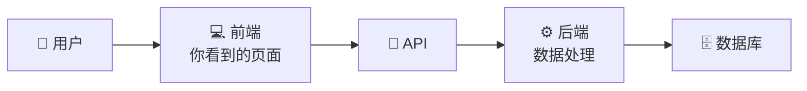
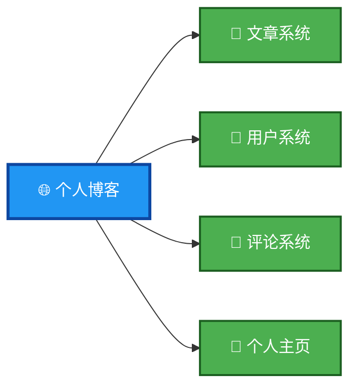
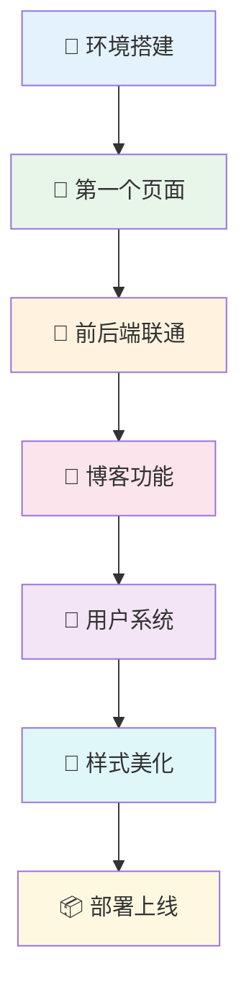

# 第 1 章：全栈开发导论

::: important 本章学习目标
- 了解什么是全栈开发和前后端分离
- 知道我们要做什么项目
- 认识 Nuxt.js 和 FastAPI 技术栈
- 明确学习路线图
:::

欢迎进入全栈开发的世界！这一章我们不会讲太多理论，只需要了解几个核心概念，然后下一章就开始动手了。

::: warning 比较功利的一个问题：全栈？能赚多少钱？
根据 2025 年的行业数据，全栈开发者的薪资范围确实很有吸引力，但比薪资数字更重要的是你创造价值的能力层级。我们可以用一个“价值金字塔”来理解：

#### 全栈开发者的价值金字塔
##### **底层**：不懂技术，只有想法 ❌
**状态**：“我有个很棒的创意，就差一个程序员了”

**现实**：想法无法落地，完全依赖他人，沟通成本极高

**结果**：要么项目永远停留在PPT，要么被外包坑，要么合伙人跑路

**收入**：大概率为零，甚至亏损

##### **中层**：掌握技术，能执行任务 ✅
**状态**：能够独立完成前后端开发，理解整个技术栈

**优势**：

可以接项目、做自由职业（月收入 1-5万+）

在企业中担任核心开发（年薪 20-50万+）

需求明确时能高效实现

**局限**：可能成为“高级技术执行者”，依赖他人给需求

**收入**：不错的技术薪资，但天花板明显

##### 顶层：技术 + 创意 = 无限可能 🚀

**状态**：不仅会写代码，还能发现痛点、设计产品、创造价值

**超能力**：

0到1的能力：从一个想法做出完整可用的产品

快速验证：低成本试错，把创意变成可测试的MVP

跨界创新：技术理解让你看到别人看不到的机会

完整掌控：从产品设计到上线运营，全程自主

**收入形态**：

打造自己的产品（被动收入可能）

技术入股创业项目

高单价咨询和解决方案

薪资只是收入的一部分

---

**关键认知**：技术是工具，创意是灵魂，市场是裁判

==我们的课程的目标是帮你成为那个"中层"，而顶层，需要你在未来的实践中不断积累和提升。==
:::

::: tip 别担心概念
如果这章有些内容看不太懂，没关系！先留个印象，后面写代码的时候自然就明白了。
:::

## 1.1 什么是全栈开发

### 1.1.1 前后端分离，一句话解释

> **前端**负责你看到的界面，**后端**负责你看不到的数据处理，它们通过 **API** 通信。

就这么简单。



::: info 全栈开发者 = 前端 + 后端都会写
所谓"全栈"，就是前端后端都能搞定。听起来很厉害？其实没那么难，跟着本课程做下来你就是了。
:::

### 1.1.2 为什么要分离？

::: tip 打个比方
就像餐厅里，服务员（前端）负责接待客人、上菜，厨师（后端）负责做菜。分工明确，效率更高。

你总不能让厨师一边炒菜一边给客人点单吧？
:::

好处很简单：
- **各干各的**：前端和后端可以同时开发，互不耽误
- **技术自由**：前端想用 Vue 就用 Vue，后端想用 Python 就用 Python
- **一套后端，多个前端**：同一套 API 可以给网站用、给 App 用、给小程序用

---

## 1.2 我们要做什么项目

### 1.2.1 一个功能完整的个人博客



做完这个项目，你会拥有：
- ✅ 一个可以发布文章的博客
- ✅ 用户注册登录系统
- ✅ 评论互动功能
- ✅ 好看的个人主页
- ✅ 部署到互联网，发给朋友看

::: warning 不只是"能用"
我们的目标不是做一个"勉强能用"的玩具，而是做一个**真正可以上线**的项目。

代码规范、项目结构、部署流程，这些"专业的事情"我们都会讲——只是不会一开始就讲，而是在你有了实践经验之后再讲。
:::

## 1.3 技术栈简介

### 1.3.1 前端：Nuxt.js（基于 Vue 3）

::: info 为什么选 Nuxt.js？
- **Vue 3**：简单易学，国内社区活跃
- **Nuxt**：Vue 的全栈框架，自动路由、SEO 友好
- **TypeScript**：类型安全，写代码有提示，不容易出错
:::

```typescript
// 长这样，后面会详细学
const { data } = await useFetch('/api/articles')
```

::: tip Nuxt.js 官方文档
[https://nuxt.com/docs](https://nuxt.com/docs/getting-started/introduction)

后面用到什么我们会讲什么，现在不用提前看。
:::

### 1.3.2 后端：FastAPI（Python）

::: info 为什么选 FastAPI？
- **Python**：语法简洁，容易上手
- **FastAPI**：现代、高性能、自动生成 API 文档
- **类型提示**：写代码有提示，接口自动生成文档
:::

```python
# 长这样，后面会详细学
@app.get("/articles/{article_id}")
async def get_article(article_id: int):
    return {"id": article_id, "title": "Hello World"}
```

::: tip FastAPI 官方文档
[https://fastapi.tiangolo.com/](https://fastapi.tiangolo.com/)

同样，后面用到什么我们会讲什么。
:::

### 1.3.3 为什么是这个组合？

| 特性 | Nuxt.js | FastAPI |
|-----|---------|---------|
| 语言 | TypeScript/JavaScript | Python |
| 学习曲线 | 平缓 | 平缓 |
| 社区 | 活跃 | 活跃 |
| 文档 | 完善 | 完善 |
| 就业市场 | Vue 是国内主流 | Python 应用广泛 |

::: tip 其实技术栈不是最重要的
重要的是**思想**。学会了前后端分离的思想，换一套技术栈（比如 React + Node.js）也能很快上手。
:::

## 1.4 学习路线图

### 1.4.1 我们的学习路径



### 1.4.2 每个阶段你会收获什么

| 阶段 | 章节 | 收获 |
|-----|------|------|
| 快速起步 | 第 0-4 章 | 🎉 前后端联通的交互式页面 |
| 功能搭建 | 第 5-8 章 | 🎉 能发布文章的博客系统 |
| 完善系统 | 第 9-11 章 | 🎉 完整的用户和评论功能 |
| 打磨上线 | 第 12-14 章 | 🎉 网站部署上线！ |

## 1.5 小结

::: note 本章回顾
- **全栈开发** = 前端 + 后端都会写
- **前后端分离** = 各干各的，通过 API 通信
- **我们的项目** = 功能完整的个人博客
- **技术栈** = Nuxt.js（前端）+ FastAPI（后端）
:::

::: important 下一步
概念了解完毕！下一章我们就开始**搭建开发环境**，然后直接写代码。

准备好了吗？Let's go! 🚀
:::
