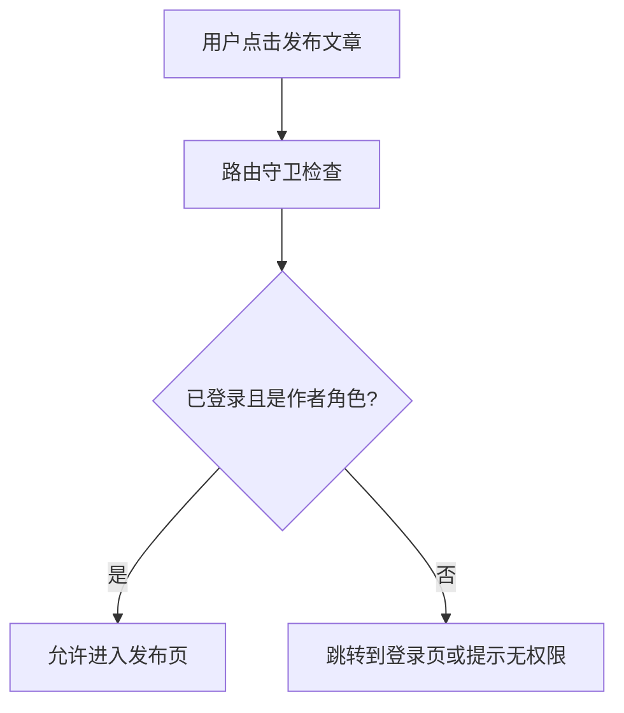

# 第 10 章：权限分级与个人中心

::: important 本章学习目标
- 理解权限分级的概念（RBAC 模型）
- 实现用户角色系统
- 学习路由守卫保护页面
- 创建个人中心与文章管理
- 🎉 **成果：不同角色有不同能力！**
:::

用户能登录了，但现在"登录"和"未登录"只有两种状态。现实世界中，不同用户应该有不同的能力——游客只能看，读者可以评论，作者才能发文章。这一章我们来实现**权限分级**！

::: tip 本章结束后你会得到什么
一个完整的权限系统——游客只能浏览，读者可以评论，作者可以发布和管理自己的文章！
:::

---

## 10.1 理解权限分级

### 10.1.1 为什么需要权限？

::: info 历史趣事：Unix 文件权限的诞生
1969 年，Ken Thompson 和 Dennis Ritchie 在贝尔实验室开发 Unix 时，面临一个问题：多个用户共用一台计算机，如何防止用户 A 删除用户 B 的文件？

他们设计了简单而优雅的解决方案：**rwx 权限系统**。
- **r** (read)：读取
- **w** (write)：写入
- **x** (execute)：执行

每个文件有三组权限：所有者、所属组、其他人。这个 1969 年的设计至今仍在使用！

当你在终端输入 `ls -l` 看到 `-rwxr-xr-x` 时，你看到的正是 55 年前的智慧结晶。
:::

目前我们的博客存在问题：
- ❌ 任何登录用户都能发文章
- ❌ 用户可以删除别人的文章？
- ❌ 没有内容审核机制

### 10.1.2 常见权限模型

| 模型 | 全称 | 特点 | 适用场景 |
|------|------|------|----------|
| **ACL** | Access Control List | 直接给用户分配权限 | 简单系统 |
| **RBAC** | Role-Based Access Control | 用户 → 角色 → 权限 | 企业应用 |
| **ABAC** | Attribute-Based Access Control | 基于属性的动态权限 | 复杂策略 |

::: info 历史趣事：RBAC 的诞生
1992 年，美国国家标准与技术研究院（NIST）的 David Ferraiolo 和 Richard Kuhn 发表了著名论文《Role-Based Access Controls》，正式提出了 RBAC 模型。

他们观察到一个现象：企业里的权限管理非常混乱——每个员工都有独立的权限列表，新员工入职要配置几十项权限，员工离职要一一撤销。

RBAC 的核心思想是：**不要给用户分配权限，给角色分配权限，再把角色分配给用户**。

新员工入职？给他一个"普通员工"角色就行。升职了？换成"经理"角色。简单又清晰！

如今，几乎所有的权限系统都采用 RBAC 或其变体。
:::

我们的博客将采用 **RBAC 模型**，因为它简单且够用。

### 10.1.3 我们的博客权限设计

<svg width="600" height="400" xmlns="http://www.w3.org/2000/svg">
  
  <!-- 继承箭头 -->
  <defs>
    <marker id="arrowhead" markerWidth="10" markerHeight="7" refX="9" refY="3.5" orient="auto">
      <polygon points="0 0, 10 3.5, 0 7" fill="#666"/>
    </marker>
  </defs>
  
  <!-- 权限层级 -->
  
  <!-- Level 0: 游客 -->
  <rect x="50" y="50" width="500" height="80" rx="8" fill="#f9f9f9" stroke="#333" stroke-width="2"/>
  <text x="300" y="75" text-anchor="middle" font-family="Arial, sans-serif" font-size="16" font-weight="bold" fill="#333">Level 0: 游客 (Guest)</text>
  
  <!-- 游客权限 -->
  <g transform="translate(70, 90)">
    <rect x="0" y="0" width="110" height="30" rx="4" fill="#f5f5f5" stroke="#999" stroke-width="1"/>
    <text x="55" y="20" text-anchor="middle" font-family="Arial, sans-serif" font-size="12" fill="#333">浏览文章列表</text>
  </g>
  
  <g transform="translate(190, 90)">
    <rect x="0" y="0" width="110" height="30" rx="4" fill="#f5f5f5" stroke="#999" stroke-width="1"/>
    <text x="55" y="20" text-anchor="middle" font-family="Arial, sans-serif" font-size="12" fill="#333">查看文章详情</text>
  </g>
  
  <g transform="translate(310, 90)">
    <rect x="0" y="0" width="110" height="30" rx="4" fill="#f5f5f5" stroke="#999" stroke-width="1"/>
    <text x="55" y="20" text-anchor="middle" font-family="Arial, sans-serif" font-size="12" fill="#666">不能评论</text>
  </g>
  
  <g transform="translate(430, 90)">
    <rect x="0" y="0" width="110" height="30" rx="4" fill="#f5f5f5" stroke="#999" stroke-width="1"/>
    <text x="55" y="20" text-anchor="middle" font-family="Arial, sans-serif" font-size="12" fill="#666">不能发文章</text>
  </g>
  
  <!-- 继承箭头 1 -->
  <line x1="300" y1="130" x2="300" y2="150" stroke="#666" stroke-width="2" marker-end="url(#arrowhead)"/>
  
  <!-- Level 1: 读者 -->
  <rect x="50" y="150" width="500" height="80" rx="8" fill="#e6f3ff" stroke="#0066cc" stroke-width="2"/>
  <text x="300" y="175" text-anchor="middle" font-family="Arial, sans-serif" font-size="16" font-weight="bold" fill="#0066cc">Level 1: 读者 (Reader) - 继承游客所有能力</text>
  
  <!-- 读者权限 -->
  <g transform="translate(200, 190)">
    <rect x="0" y="0" width="110" height="30" rx="4" fill="#e6f3ff" stroke="#66aaff" stroke-width="1"/>
    <text x="55" y="20" text-anchor="middle" font-family="Arial, sans-serif" font-size="12" fill="#0066cc">评论文章</text>
  </g>
  
  <g transform="translate(320, 190)">
    <rect x="0" y="0" width="110" height="30" rx="4" fill="#e6f3ff" stroke="#66aaff" stroke-width="1"/>
    <text x="55" y="20" text-anchor="middle" font-family="Arial, sans-serif" font-size="12" fill="#0066cc">点赞</text>
  </g>
  
  <!-- 继承箭头 2 -->
  <line x1="300" y1="230" x2="300" y2="250" stroke="#666" stroke-width="2" marker-end="url(#arrowhead)"/>
  
  <!-- Level 2: 作者 -->
  <rect x="50" y="250" width="500" height="80" rx="8" fill="#e6ffe6" stroke="#009900" stroke-width="2"/>
  <text x="300" y="275" text-anchor="middle" font-family="Arial, sans-serif" font-size="16" font-weight="bold" fill="#009900">Level 2: 作者 (Author) - 继承读者所有能力</text>
  
  <!-- 作者权限 -->
  <g transform="translate(200, 290)">
    <rect x="0" y="0" width="110" height="30" rx="4" fill="#e6ffe6" stroke="#66cc66" stroke-width="1"/>
    <text x="55" y="20" text-anchor="middle" font-family="Arial, sans-serif" font-size="12" fill="#009900">发布文章</text>
  </g>
  
  <g transform="translate(320, 290)">
    <rect x="0" y="0" width="110" height="30" rx="4" fill="#e6ffe6" stroke="#66cc66" stroke-width="1"/>
    <text x="55" y="20" text-anchor="middle" font-family="Arial, sans-serif" font-size="12" fill="#009900">编辑/删除文章</text>
  </g>
  
  <!-- 说明文字 -->
  <text x="300" y="350" text-anchor="middle" font-family="Arial, sans-serif" font-size="12" fill="#666">权限继承关系：游客 → 读者 → 作者</text>
</svg>

::: tip 为什么不一开始就设计管理员？
遵循"最小可行产品"原则——先实现核心功能，再逐步扩展。管理员角色可以作为练习题！
:::

## 10.2 后端：用户角色系统

### 10.2.1 给 User 模型添加 role 字段

修改 `backend/src/backend/models.py`：

```python
# backend/src/backend/models.py
from sqlalchemy import Column, Integer, String, Text, ForeignKey, Enum
from sqlalchemy.orm import relationship
from .database import Base
import enum


class UserRole(str, enum.Enum):
    """用户角色枚举"""
    reader = "reader"   # 读者（默认）
    author = "author"   # 作者


class User(Base):
    """用户模型"""
    __tablename__ = "users"

    id = Column(Integer, primary_key=True, index=True)
    username = Column(String(50), unique=True, nullable=False, index=True)
    email = Column(String(100), unique=True, nullable=False, index=True)
    hashed_password = Column(String(200), nullable=False)
    created_at = Column(String(20))
    avatar = Column(String(500), default="")
    
    # 新增：用户角色
    role = Column(String(20), default=UserRole.reader.value)

    articles = relationship("Article", back_populates="user")

    def to_dict(self):
        return {
            "id": self.id,
            "username": self.username,
            "email": self.email,
            "created_at": self.created_at,
            "avatar": self.avatar,
            "role": self.role  # 返回角色信息
        }
    
    def has_permission(self, required_role: str) -> bool:
        """检查用户是否有某个角色的权限"""
        role_levels = {
            "reader": 1,
            "author": 2,
        }
        return role_levels.get(self.role, 0) >= role_levels.get(required_role, 0)
```

::: note 为什么用字符串而不是枚举类型？
SQLite 对枚举类型的支持有限。使用字符串存储更简单，而且我们在 Python 代码中仍然用 `UserRole` 枚举来保证类型安全。
:::

### 10.2.2 更新 Schema

修改 `backend/src/backend/schemas.py`，添加角色相关内容：

```python
# 在 schemas.py 中添加

from typing import Literal

class UserResponse(BaseModel):
    """用户信息响应"""
    id: int
    username: str
    email: str
    created_at: str
    avatar: str
    role: str  # 新增


class RoleUpdateRequest(BaseModel):
    """角色更新请求"""
    role: Literal["reader", "author"]
```

### 10.2.3 创建权限检查装饰器

在 `backend/src/backend/auth.py` 中添加权限检查功能：

```python
# 在 auth.py 末尾添加

from functools import wraps
from .models import UserRole


def require_role(required_role: str):
    """
    权限检查装饰器工厂
    用法：@require_role("author")
    """
    async def role_checker(
        current_user: User = Depends(get_current_user_required)
    ) -> User:
        if not current_user.has_permission(required_role):
            raise HTTPException(
                status_code=status.HTTP_403_FORBIDDEN,
                detail=f"权限不足，需要 {required_role} 角色"
            )
        return current_user
    
    return role_checker


# 预定义的角色检查器
require_reader = require_role("reader")
require_author = require_role("author")
```

::: tip 403 vs 401 的区别
- **401 Unauthorized**：未认证（没登录）
- **403 Forbidden**：已认证但无权限（登录了但权限不够）

这两个 HTTP 状态码的命名有点反直觉，但这是历史遗留问题。
:::

### 10.2.4 修改发布文章 API

现在让我们用权限检查来保护发布文章的 API。修改 `backend/src/backend/__init__.py`：

```python
# 修改发布文章 API
from .auth import get_current_user_required, require_author

@app.post("/api/articles")
def create_article(
    article: ArticleCreate, 
    db: Session = Depends(get_db),
    current_user: User = Depends(require_author)  # 需要作者权限！
):
    """发布新文章（需要作者权限）"""
    db_article = Article(
        title=article.title,
        summary=article.summary or article.content[:100] + "...",
        content=article.content,
        author=current_user.username,
        created_at=datetime.now().strftime("%Y-%m-%d"),
        tags=article.tags,
        user_id=current_user.id
    )
    
    db.add(db_article)
    db.commit()
    db.refresh(db_article)
    
    return {
        "message": "发布成功",
        "article": db_article.to_dict()
    }
```

::: warning 前端权限检查只是体验优化！
有些同学可能会问：前端也做了权限检查，后端还需要吗？

**答案是必须的！**

前端的权限检查只是为了更好的用户体验（不让用户看到他无权访问的按钮），但前端代码是可以被篡改的。真正的安全必须靠后端保障。

这就是所谓的"前端做体验，后端做安全"。
:::

### 10.2.5 添加角色升级 API

用户注册时默认是 reader，如何成为 author？我们提供一个简单的"申请成为作者"API：

```python
# 在 __init__.py 中添加

@app.post("/api/users/become-author")
def become_author(
    db: Session = Depends(get_db),
    current_user: User = Depends(get_current_user_required)
):
    """申请成为作者"""
    if current_user.role == UserRole.author.value:
        raise HTTPException(status_code=400, detail="你已经是作者了")
    
    current_user.role = UserRole.author.value
    db.commit()
    
    return {
        "message": "恭喜！你现在是作者了，可以发布文章啦！",
        "user": current_user.to_dict()
    }
```

::: note 真实场景下的角色管理
在真实项目中，角色升级通常需要审核流程，比如：
- 提交申请 → 管理员审核 → 通过/拒绝
- 或者满足某些条件自动升级（发表评论数达到 10 条）

这里为了简化，我们直接让用户"自助升级"。
:::

## 10.3 前端：路由守卫

### 10.3.1 什么是路由守卫？

路由守卫就是在进入某个页面之前的"安检员"——检查用户是否有权限访问这个页面。



### 10.3.2 Nuxt 中间件机制

在 Nuxt 中，路由守卫通过 **middleware（中间件）** 实现。中间件是在页面渲染之前执行的函数。

中间件可以是：
- **全局中间件**：每次路由变化都执行
- **页面中间件**：只在特定页面执行

### 10.3.3 创建 auth 中间件

在 `frontend/app/middleware/` 目录下创建 `auth.ts`：

```typescript
// frontend/app/middleware/auth.ts
export default defineNuxtRouteMiddleware((to, from) => {
  const { isLoggedIn } = useAuth()
  
  // 如果未登录，重定向到登录页
  if (!isLoggedIn.value) {
    return navigateTo({
      path: '/auth/login',
      query: { redirect: to.fullPath }  // 记录原本要去的页面
    })
  }
})
```

### 10.3.4 创建 role 中间件

创建 `frontend/app/middleware/author.ts`：

```typescript
// frontend/app/middleware/author.ts
export default defineNuxtRouteMiddleware((to, from) => {
  const { user, isLoggedIn } = useAuth()
  
  // 先检查是否登录
  if (!isLoggedIn.value) {
    return navigateTo({
      path: '/auth/login',
      query: { redirect: to.fullPath }
    })
  }
  
  // 再检查是否是作者
  if (user.value?.role !== 'author') {
    // 可以跳转到提示页面，或者返回上一页
    return navigateTo({
      path: '/user',
      query: { message: 'need-author' }  // 提示需要成为作者
    })
  }
})
```

### 10.3.5 保护发布页面

修改 `frontend/app/pages/blog/publish.vue`，添加中间件：

```vue
<!-- frontend/app/pages/blog/publish.vue -->
<script setup>
// 使用 author 中间件保护此页面
definePageMeta({
  middleware: ['author']
})

// ... 其他代码保持不变
</script>
```

::: tip definePageMeta 的作用
`definePageMeta` 是 Nuxt 3 的宏，用于定义页面级别的元信息，包括：
- `middleware`：页面中间件
- `layout`：使用的布局
- `title`：页面标题
:::

## 10.4 个人中心页面

### 10.4.1 创建权限工具 composable

创建 `frontend/app/composables/usePermission.ts`：

```typescript
// frontend/app/composables/usePermission.ts
export const usePermission = () => {
  const { user, isLoggedIn } = useAuth()
  
  // 检查是否有某个角色
  const hasRole = (role: string) => {
    if (!isLoggedIn.value || !user.value) return false
    
    const roleLevels: Record<string, number> = {
      reader: 1,
      author: 2,
    }
    
    const userLevel = roleLevels[user.value.role] || 0
    const requiredLevel = roleLevels[role] || 0
    
    return userLevel >= requiredLevel
  }
  
  // 常用权限检查
  const canComment = computed(() => isLoggedIn.value)
  const canPublish = computed(() => hasRole('author'))
  const isAuthor = computed(() => user.value?.role === 'author')
  
  // 检查是否是某篇文章的所有者
  const isOwner = (articleUserId: number) => {
    return user.value?.id === articleUserId
  }
  
  return {
    hasRole,
    canComment,
    canPublish,
    isAuthor,
    isOwner
  }
}
```

### 10.4.2 创建个人中心路由

创建 `frontend/app/pages/user/index.vue`：

```vue
<!-- frontend/app/pages/user/index.vue -->
<template>
  <div class="user-center">
    <div class="profile-header">
      <div class="avatar-section">
        <div class="avatar">
          {{ user?.username?.charAt(0).toUpperCase() }}
        </div>
        <div class="user-info">
          <h1 class="username">{{ user?.username }}</h1>
          <span class="role-badge" :class="user?.role">
            {{ roleLabel }}
          </span>
        </div>
      </div>
      
      <div class="user-meta">
        <p>📧 {{ user?.email }}</p>
        <p>📅 注册于 {{ user?.created_at }}</p>
      </div>
    </div>
    
    <!-- 提示消息 -->
    <div v-if="needAuthorMessage" class="tip-banner warning">
      ⚠️ 你需要成为作者才能发布文章。
      <button @click="becomeAuthor" class="btn-small">立即成为作者</button>
    </div>
    
    <!-- 功能入口 -->
    <div class="feature-cards">
      <NuxtLink to="/user/articles" class="feature-card">
        <span class="icon">📝</span>
        <span class="title">我的文章</span>
        <span class="desc">查看和管理你发布的文章</span>
      </NuxtLink>
      
      <div 
        v-if="!isAuthor" 
        class="feature-card action"
        @click="becomeAuthor"
      >
        <span class="icon">✨</span>
        <span class="title">成为作者</span>
        <span class="desc">获得发布文章的权限</span>
      </div>
      
      <NuxtLink 
        v-if="canPublish" 
        to="/blog/publish" 
        class="feature-card"
      >
        <span class="icon">🚀</span>
        <span class="title">发布文章</span>
        <span class="desc">分享你的想法和知识</span>
      </NuxtLink>
    </div>
  </div>
</template>

<script setup>
definePageMeta({
  middleware: ['auth']  // 需要登录
})

const route = useRoute()
const { user, token } = useAuth()
const { canPublish, isAuthor } = usePermission()

// 检查是否有提示消息
const needAuthorMessage = computed(() => route.query.message === 'need-author')

// 角色标签
const roleLabel = computed(() => {
  const labels = {
    reader: '📖 读者',
    author: '✍️ 作者',
  }
  return labels[user.value?.role] || '用户'
})

// 成为作者
async function becomeAuthor() {
  try {
    const response = await $fetch('http://localhost:8000/api/users/become-author', {
      method: 'POST',
      headers: {
        Authorization: `Bearer ${token.value}`
      }
    })
    
    // 更新本地用户信息
    if (user.value) {
      user.value.role = 'author'
      localStorage.setItem('user', JSON.stringify(user.value))
    }
    
    alert('🎉 ' + response.message)
  } catch (error) {
    alert('操作失败：' + (error.data?.detail || '未知错误'))
  }
}
</script>

<style scoped>
.user-center {
  max-width: 800px;
  margin: 0 auto;
  padding: 2rem;
}

.profile-header {
  background: linear-gradient(135deg, #667eea 0%, #764ba2 100%);
  border-radius: 1rem;
  padding: 2rem;
  color: white;
  margin-bottom: 2rem;
}

.avatar-section {
  display: flex;
  align-items: center;
  gap: 1.5rem;
  margin-bottom: 1rem;
}

.avatar {
  width: 80px;
  height: 80px;
  background: rgba(255, 255, 255, 0.2);
  border-radius: 50%;
  display: flex;
  align-items: center;
  justify-content: center;
  font-size: 2rem;
  font-weight: bold;
}

.username {
  font-size: 1.75rem;
  margin: 0 0 0.5rem 0;
}

.role-badge {
  display: inline-block;
  padding: 0.25rem 0.75rem;
  border-radius: 1rem;
  font-size: 0.875rem;
  background: rgba(255, 255, 255, 0.2);
}

.role-badge.author {
  background: rgba(255, 215, 0, 0.3);
}

.user-meta {
  opacity: 0.9;
  font-size: 0.9rem;
}

.user-meta p {
  margin: 0.25rem 0;
}

.tip-banner {
  padding: 1rem;
  border-radius: 0.5rem;
  margin-bottom: 2rem;
  display: flex;
  align-items: center;
  justify-content: space-between;
}

.tip-banner.warning {
  background: #fef3cd;
  color: #856404;
}

.btn-small {
  padding: 0.5rem 1rem;
  background: #856404;
  color: white;
  border: none;
  border-radius: 0.25rem;
  cursor: pointer;
}

.feature-cards {
  display: grid;
  grid-template-columns: repeat(auto-fit, minmax(200px, 1fr));
  gap: 1rem;
}

.feature-card {
  background: white;
  border: 2px solid #e5e7eb;
  border-radius: 1rem;
  padding: 1.5rem;
  text-decoration: none;
  color: inherit;
  display: flex;
  flex-direction: column;
  transition: all 0.2s;
}

.feature-card:hover {
  border-color: #667eea;
  transform: translateY(-2px);
  box-shadow: 0 4px 12px rgba(0, 0, 0, 0.1);
}

.feature-card.action {
  cursor: pointer;
  border-style: dashed;
}

.feature-card .icon {
  font-size: 2rem;
  margin-bottom: 0.5rem;
}

.feature-card .title {
  font-weight: 600;
  font-size: 1.1rem;
  margin-bottom: 0.25rem;
}

.feature-card .desc {
  font-size: 0.875rem;
  color: #6b7280;
}
</style>
```

## 10.5 我的文章管理

### 10.5.1 后端：获取用户文章 API

在 `backend/src/backend/__init__.py` 中添加：

```python
@app.get("/api/users/me/articles")
def get_my_articles(
    db: Session = Depends(get_db),
    current_user: User = Depends(get_current_user_required)
):
    """获取当前用户的文章列表"""
    articles = db.query(Article).filter(
        Article.user_id == current_user.id
    ).order_by(Article.id.desc()).all()
    
    return {
        "articles": [article.to_dict() for article in articles],
        "total": len(articles)
    }
```

### 10.5.2 前端：我的文章列表

创建 `frontend/app/pages/user/articles.vue`：

```vue
<!-- frontend/app/pages/user/articles.vue -->
<template>
  <div class="my-articles">
    <div class="page-header">
      <h1>📝 我的文章</h1>
      <NuxtLink v-if="canPublish" to="/blog/publish" class="btn-publish">
        ✍️ 写新文章
      </NuxtLink>
    </div>
    
    <!-- 加载中 -->
    <div v-if="pending" class="loading">
      加载中...
    </div>
    
    <!-- 文章列表 -->
    <div v-else-if="articles.length > 0" class="article-list">
      <div 
        v-for="article in articles" 
        :key="article.id" 
        class="article-item"
      >
        <div class="article-info">
          <NuxtLink :to="`/blog/${article.id}`" class="article-title">
            {{ article.title }}
          </NuxtLink>
          <p class="article-meta">
            发布于 {{ article.created_at }}
          </p>
        </div>
        
        <div class="article-actions">
          <NuxtLink :to="`/blog/edit/${article.id}`" class="btn-edit">
            ✏️ 编辑
          </NuxtLink>
          <button @click="confirmDelete(article)" class="btn-delete">
            🗑️ 删除
          </button>
        </div>
      </div>
    </div>
    
    <!-- 空状态 -->
    <div v-else class="empty-state">
      <p class="empty-icon">📭</p>
      <p class="empty-text">你还没有发布过文章</p>
      <NuxtLink v-if="canPublish" to="/blog/publish" class="btn-publish">
        发布第一篇文章
      </NuxtLink>
      <button v-else @click="becomeAuthor" class="btn-publish">
        成为作者，开始创作
      </button>
    </div>
    
    <!-- 删除确认弹窗 -->
    <div v-if="showDeleteModal" class="modal-overlay" @click="showDeleteModal = false">
      <div class="modal-content" @click.stop>
        <h3>确认删除</h3>
        <p>确定要删除文章「{{ articleToDelete?.title }}」吗？</p>
        <p class="warning-text">⚠️ 此操作不可撤销！</p>
        <div class="modal-actions">
          <button @click="showDeleteModal = false" class="btn-cancel">取消</button>
          <button @click="deleteArticle" class="btn-confirm-delete">确认删除</button>
        </div>
      </div>
    </div>
  </div>
</template>

<script setup>
definePageMeta({
  middleware: ['auth']
})

const { token, user } = useAuth()
const { canPublish } = usePermission()

// 获取文章列表
const { data, pending, refresh } = await useFetch('http://localhost:8000/api/users/me/articles', {
  headers: {
    Authorization: `Bearer ${token.value}`
  }
})

const articles = computed(() => data.value?.articles || [])

// 删除相关
const showDeleteModal = ref(false)
const articleToDelete = ref(null)

function confirmDelete(article) {
  articleToDelete.value = article
  showDeleteModal.value = true
}

async function deleteArticle() {
  if (!articleToDelete.value) return
  
  try {
    await $fetch(`http://localhost:8000/api/articles/${articleToDelete.value.id}`, {
      method: 'DELETE',
      headers: {
        Authorization: `Bearer ${token.value}`
      }
    })
    
    showDeleteModal.value = false
    articleToDelete.value = null
    refresh()  // 刷新列表
  } catch (error) {
    alert('删除失败：' + (error.data?.detail || '未知错误'))
  }
}

// 成为作者
async function becomeAuthor() {
  try {
    await $fetch('http://localhost:8000/api/users/become-author', {
      method: 'POST',
      headers: {
        Authorization: `Bearer ${token.value}`
      }
    })
    
    if (user.value) {
      user.value.role = 'author'
      localStorage.setItem('user', JSON.stringify(user.value))
    }
    
    alert('🎉 你现在是作者了！')
  } catch (error) {
    alert('操作失败')
  }
}
</script>

<style scoped>
.my-articles {
  max-width: 800px;
  margin: 0 auto;
  padding: 2rem;
}

.page-header {
  display: flex;
  justify-content: space-between;
  align-items: center;
  margin-bottom: 2rem;
}

.page-header h1 {
  margin: 0;
}

.btn-publish {
  padding: 0.75rem 1.5rem;
  background: linear-gradient(135deg, #667eea 0%, #764ba2 100%);
  color: white;
  text-decoration: none;
  border-radius: 0.5rem;
  border: none;
  cursor: pointer;
  font-weight: 500;
}

.loading {
  text-align: center;
  padding: 3rem;
  color: #6b7280;
}

.article-list {
  display: flex;
  flex-direction: column;
  gap: 1rem;
}

.article-item {
  display: flex;
  justify-content: space-between;
  align-items: center;
  padding: 1.25rem;
  background: white;
  border: 1px solid #e5e7eb;
  border-radius: 0.75rem;
  transition: box-shadow 0.2s;
}

.article-item:hover {
  box-shadow: 0 4px 12px rgba(0, 0, 0, 0.05);
}

.article-title {
  font-weight: 600;
  color: #1a202c;
  text-decoration: none;
  font-size: 1.1rem;
}

.article-title:hover {
  color: #667eea;
}

.article-meta {
  font-size: 0.875rem;
  color: #6b7280;
  margin-top: 0.25rem;
}

.article-actions {
  display: flex;
  gap: 0.5rem;
}

.btn-edit,
.btn-delete {
  padding: 0.5rem 1rem;
  border-radius: 0.375rem;
  font-size: 0.875rem;
  cursor: pointer;
  border: none;
  text-decoration: none;
}

.btn-edit {
  background: #e5e7eb;
  color: #374151;
}

.btn-delete {
  background: #fee2e2;
  color: #dc2626;
}

.empty-state {
  text-align: center;
  padding: 4rem 2rem;
}

.empty-icon {
  font-size: 4rem;
  margin-bottom: 1rem;
}

.empty-text {
  color: #6b7280;
  margin-bottom: 1.5rem;
}

/* 模态框样式 */
.modal-overlay {
  position: fixed;
  top: 0;
  left: 0;
  right: 0;
  bottom: 0;
  background: rgba(0, 0, 0, 0.5);
  display: flex;
  align-items: center;
  justify-content: center;
  z-index: 1000;
}

.modal-content {
  background: white;
  padding: 2rem;
  border-radius: 1rem;
  max-width: 400px;
  width: 90%;
}

.modal-content h3 {
  margin-top: 0;
}

.warning-text {
  color: #dc2626;
  font-size: 0.875rem;
}

.modal-actions {
  display: flex;
  gap: 1rem;
  margin-top: 1.5rem;
}

.btn-cancel {
  flex: 1;
  padding: 0.75rem;
  background: #e5e7eb;
  border: none;
  border-radius: 0.5rem;
  cursor: pointer;
}

.btn-confirm-delete {
  flex: 1;
  padding: 0.75rem;
  background: #dc2626;
  color: white;
  border: none;
  border-radius: 0.5rem;
  cursor: pointer;
}
</style>
```

## 10.6 编辑与删除文章

### 10.6.1 后端：更新文章 API（PUT 方法）

::: info HTTP 方法与 CRUD 的对应
| 操作 | HTTP 方法 | 说明 |
|------|-----------|------|
| Create | POST | 创建新资源 |
| Read | GET | 读取资源 |
| Update | PUT / PATCH | 更新资源 |
| Delete | DELETE | 删除资源 |

PUT 和 PATCH 的区别：
- **PUT**：完整替换资源
- **PATCH**：部分更新资源

我们使用 PUT，因为编辑时会提交完整的文章内容。
:::

在 `backend/src/backend/__init__.py` 中添加：

```python
@app.put("/api/articles/{article_id}")
def update_article(
    article_id: int,
    article_data: ArticleCreate,
    db: Session = Depends(get_db),
    current_user: User = Depends(require_author)  # 需要作者权限
):
    """更新文章"""
    # 查找文章
    article = db.query(Article).filter(Article.id == article_id).first()
    if not article:
        raise HTTPException(status_code=404, detail="文章不存在")
    
    # 检查所有权
    if article.user_id != current_user.id:
        raise HTTPException(status_code=403, detail="你只能编辑自己的文章")
    
    # 更新字段
    article.title = article_data.title
    article.content = article_data.content
    article.summary = article_data.summary or article_data.content[:100] + "..."
    article.tags = article_data.tags
    
    db.commit()
    db.refresh(article)
    
    return {
        "message": "更新成功",
        "article": article.to_dict()
    }
```

::: caution 权限双重验证
注意我们做了两层检查：
1. **角色检查**：`require_author` 确保只有作者能调用此 API
2. **所有权检查**：`article.user_id != current_user.id` 确保只能编辑自己的文章

这种"双重验证"模式在实际项目中非常重要！
:::

### 10.6.2 后端：删除文章 API（DELETE 方法）

```python
@app.delete("/api/articles/{article_id}")
def delete_article(
    article_id: int,
    db: Session = Depends(get_db),
    current_user: User = Depends(require_author)
):
    """删除文章"""
    article = db.query(Article).filter(Article.id == article_id).first()
    if not article:
        raise HTTPException(status_code=404, detail="文章不存在")
    
    # 检查所有权
    if article.user_id != current_user.id:
        raise HTTPException(status_code=403, detail="你只能删除自己的文章")
    
    db.delete(article)
    db.commit()
    
    return {"message": "删除成功"}
```

::: tip 软删除 vs 硬删除
我们这里用的是**硬删除**——数据直接从数据库中移除。

在生产环境中，通常推荐**软删除**：
- 给表添加 `is_deleted` 字段
- 删除时只是把 `is_deleted` 设为 True
- 查询时过滤掉 `is_deleted = True` 的记录

好处是数据可以恢复，也方便审计。这个可以作为练习来实现！
:::

### 10.6.3 前端：编辑页面

创建 `frontend/app/pages/blog/edit/[id].vue`：

```vue
<!-- frontend/app/pages/blog/edit/[id].vue -->
<template>
  <div class="edit-page">
    <h1>✏️ 编辑文章</h1>
    
    <div v-if="pending" class="loading">加载中...</div>
    
    <form v-else @submit.prevent="handleSubmit" class="edit-form">
      <div class="form-group">
        <label for="title">文章标题</label>
        <input
          id="title"
          v-model="form.title"
          type="text"
          placeholder="给你的文章起个标题"
          required
        />
      </div>
      
      <div class="form-group">
        <label for="content">文章内容（支持 Markdown）</label>
        <textarea
          id="content"
          v-model="form.content"
          placeholder="开始写作..."
          rows="15"
          required
        ></textarea>
      </div>
      
      <div class="form-group">
        <label for="tags">标签（用逗号分隔）</label>
        <input
          id="tags"
          v-model="form.tags"
          type="text"
          placeholder="Vue,前端,教程"
        />
      </div>
      
      <div class="form-actions">
        <NuxtLink to="/user/articles" class="btn-cancel">取消</NuxtLink>
        <button type="submit" class="btn-submit" :disabled="isSubmitting">
          {{ isSubmitting ? '保存中...' : '保存修改' }}
        </button>
      </div>
    </form>
  </div>
</template>

<script setup>
definePageMeta({
  middleware: ['author']
})

const route = useRoute()
const { token } = useAuth()

const articleId = route.params.id

// 获取文章详情
const { data, pending } = await useFetch(`http://localhost:8000/api/articles/${articleId}`)

// 表单数据
const form = reactive({
  title: '',
  content: '',
  tags: ''
})

// 填充表单
watch(data, (newData) => {
  if (newData) {
    form.title = newData.title
    form.content = newData.content
    form.tags = newData.tags?.join(',') || ''
  }
}, { immediate: true })

const isSubmitting = ref(false)

async function handleSubmit() {
  isSubmitting.value = true
  
  try {
    await $fetch(`http://localhost:8000/api/articles/${articleId}`, {
      method: 'PUT',
      headers: {
        Authorization: `Bearer ${token.value}`
      },
      body: {
        title: form.title,
        content: form.content,
        tags: form.tags
      }
    })
    
    navigateTo(`/blog/${articleId}`)
  } catch (error) {
    alert('保存失败：' + (error.data?.detail || '未知错误'))
  } finally {
    isSubmitting.value = false
  }
}
</script>

<style scoped>
.edit-page {
  max-width: 800px;
  margin: 0 auto;
  padding: 2rem;
}

.loading {
  text-align: center;
  padding: 3rem;
  color: #6b7280;
}

.edit-form {
  display: flex;
  flex-direction: column;
  gap: 1.5rem;
}

.form-group {
  display: flex;
  flex-direction: column;
  gap: 0.5rem;
}

.form-group label {
  font-weight: 500;
  color: #374151;
}

.form-group input,
.form-group textarea {
  padding: 0.75rem 1rem;
  border: 2px solid #e5e7eb;
  border-radius: 0.5rem;
  font-size: 1rem;
  transition: border-color 0.2s;
}

.form-group input:focus,
.form-group textarea:focus {
  outline: none;
  border-color: #667eea;
}

.form-group textarea {
  resize: vertical;
  font-family: 'Monaco', 'Menlo', monospace;
  line-height: 1.6;
}

.form-actions {
  display: flex;
  gap: 1rem;
  justify-content: flex-end;
}

.btn-cancel {
  padding: 0.75rem 1.5rem;
  background: #e5e7eb;
  color: #374151;
  text-decoration: none;
  border-radius: 0.5rem;
}

.btn-submit {
  padding: 0.75rem 1.5rem;
  background: linear-gradient(135deg, #667eea 0%, #764ba2 100%);
  color: white;
  border: none;
  border-radius: 0.5rem;
  cursor: pointer;
  font-weight: 500;
}

.btn-submit:disabled {
  opacity: 0.6;
  cursor: not-allowed;
}
</style>
```

## 10.7 小结与练习

::: important 🎉 恭喜你完成了权限系统！
现在你的博客具备了：
- ✅ **用户角色**：读者和作者
- ✅ **路由守卫**：保护需要权限的页面
- ✅ **个人中心**：用户管理自己的空间
- ✅ **文章管理**：编辑和删除自己的文章

你已经掌握了 RBAC 权限模型的核心思想！
:::

### 本章回顾

| 概念 | 说明 |
|------|------|
| RBAC | 基于角色的访问控制，用户 → 角色 → 权限 |
| 中间件 | 在路由跳转前执行的检查函数 |
| 权限分级 | 不同角色有不同的能力 |
| 所有权检查 | 只能操作属于自己的资源 |

### 动手练习

::: tip 练习提示
到现在你已经学会了绝大部分内容，下面的练习题将帮助你巩固并扩展所学知识。可以适当使用 AI 辅助编程，但是切记要独立思考！
:::

**练习 1：实现文章置顶功能** ⭐⭐⭐

给 Article 表添加 `is_pinned` 字段，只有管理员可以置顶/取消置顶文章。

提示：
- 添加 admin 角色
- 创建 `POST /api/articles/{id}/pin` API
- 文章列表页置顶文章显示在最前面

**练习 2：实现软删除** ⭐⭐

给 Article 表添加 `is_deleted` 字段，删除时不真正删除，而是标记为已删除。

提示：
- 所有查询都要过滤 `is_deleted = False`
- 可以添加"回收站"功能

::: info 下一章预告

权限系统完成了，但博客还缺少互动性——读者想评论怎么办？

下一章我们将学习**插件化思维**，实现一个可以开关的评论系统！

:::
