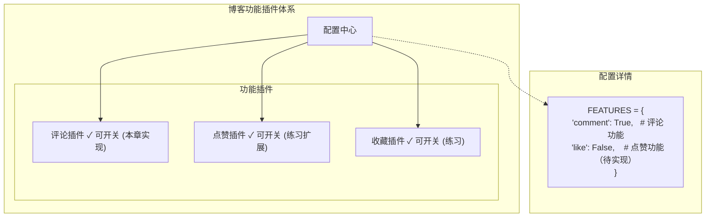
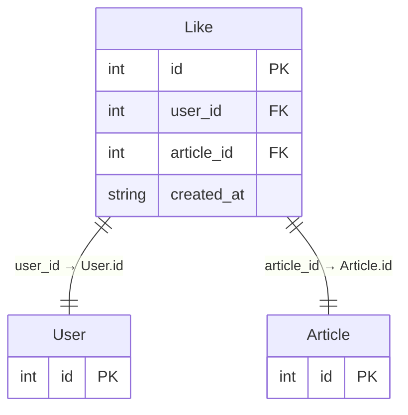

# 第 11 章：插件化评论系统

::: important 本章学习目标
- 理解插件化架构思维
- 学习 Feature Flag 模式
- 实现可开关的评论功能
- 掌握功能模块化设计
- 🎉 **成果：一个可开关的评论系统！**
:::

博客光能看不能互动？读者想发表看法怎么办？这一章我们来实现评论功能！

但我们不仅仅是"实现评论"，更重要的是学习**插件化思维**——功能应该像插件一样可以自由开关、灵活配置。

::: tip 本章结束后你会得到什么
一个插件化的评论系统——可以全局开关，也可以单篇文章关闭评论，为未来扩展（点赞、收藏）打下基础！
:::


## 11.1 插件化思维入门

### 11.1.1 什么是插件化？

::: info 历史趣事：WordPress 插件生态
WordPress 是世界上最成功的内容管理系统，你知道它成功的秘诀吗？

**插件系统。**

WordPress 自己只提供核心功能（发文章、管理用户），其他一切都可以通过插件实现。想要电商功能？装 WooCommerce 插件。想要 SEO 优化？装 Yoast SEO 插件。

截至 2024 年，WordPress 插件市场有超过 **60,000 个插件**，这让 WordPress 可以满足几乎任何需求。

这种"核心+插件"的架构思想，影响了无数软件的设计，包括 VS Code（你现在用的编辑器！）、Chrome 浏览器等。
:::

**插件化的核心思想**：
- 功能模块化，各自独立
- 可以随时开启/关闭
- 不影响核心系统运行
- 易于扩展和维护

### 11.1.2 为什么需要功能开关？

想象这些场景：
- 新功能还在测试中，只想让 10% 的用户先用
- 某篇文章讨论太激烈，想临时关闭评论
- 服务器压力大，暂时关闭非核心功能
- A/B 测试，对比有评论和无评论的用户行为

这些都需要**功能开关（Feature Flag）**！

### 11.1.3 Feature Flag 模式

::: info 历史趣事：Facebook 的灰度发布
Feature Flag 的概念在 2000 年代就存在了，但真正让它流行起来的是 Facebook。

Facebook 每天要发布多次代码更新，面向 20 亿用户。如果新功能有 bug，影响范围是灾难性的。

他们的解决方案是：**把新功能包在 Feature Flag 里**。

```
if (feature_enabled("new_comment_system")) {
    // 使用新评论系统
} else {
    // 使用旧评论系统
}
```

新功能先只对 1% 的用户开放，没问题就逐渐扩大到 10%、50%、100%。有问题？一行配置就能回滚。

这种做法后来成为互联网公司的标准实践，催生了 LaunchDarkly、Flagsmith 等专门的 Feature Flag 服务。
:::

### 11.1.4 我们的插件化设计



## 11.2 功能配置中心

### 11.2.1 后端：创建配置文件

创建 `backend/src/backend/config.py`：

```python
# backend/src/backend/config.py
"""
功能配置中心
所有可开关的功能都在这里统一管理
"""

# 功能开关
FEATURES = {
    "comment": True,      # 评论功能（本章实现）
    "like": False,        # 点赞功能（练习题）
    "favorite": False,    # 收藏功能（练习题）
}


def is_feature_enabled(feature_name: str) -> bool:
    """检查某个功能是否开启"""
    return FEATURES.get(feature_name, False)


def get_all_features() -> dict:
    """获取所有功能的状态"""
    return FEATURES.copy()
```

::: tip 为什么用单独的配置文件？
把配置集中管理有很多好处：
- 一目了然：所有功能开关在一个地方
- 易于修改：改一行代码就能开关功能
- 方便扩展：未来可以改成从数据库或远程服务读取
:::

### 11.2.2 添加功能状态 API

在 `backend/src/backend/__init__.py` 中添加：

```python
from .config import get_all_features, is_feature_enabled

@app.get("/api/features")
def get_features():
    """获取所有功能的开关状态"""
    return get_all_features()


@app.get("/api/features/{feature_name}")
def get_feature_status(feature_name: str):
    """获取单个功能的状态"""
    return {
        "feature": feature_name,
        "enabled": is_feature_enabled(feature_name)
    }
```

### 11.2.3 前端：功能开关 Hook

创建 `frontend/app/composables/useFeature.ts`：

```typescript
// frontend/app/composables/useFeature.ts

// 功能状态缓存
const featuresCache = ref<Record<string, boolean> | null>(null)
const featuresLoading = ref(false)

export const useFeature = () => {
  // 加载功能配置
  const loadFeatures = async () => {
    if (featuresCache.value || featuresLoading.value) return
    
    featuresLoading.value = true
    try {
      const data = await $fetch<Record<string, boolean>>(
        'http://localhost:8000/api/features'
      )
      featuresCache.value = data
    } catch (error) {
      console.error('加载功能配置失败:', error)
      // 失败时使用默认值
      featuresCache.value = {
        comment: true,
        like: false,
        favorite: false
      }
    } finally {
      featuresLoading.value = false
    }
  }
  
  // 检查功能是否开启
  const isEnabled = (featureName: string): boolean => {
    return featuresCache.value?.[featureName] ?? false
  }
  
  // 常用功能的快捷检查
  const commentEnabled = computed(() => isEnabled('comment'))
  const likeEnabled = computed(() => isEnabled('like'))
  const favoriteEnabled = computed(() => isEnabled('favorite'))
  
  return {
    loadFeatures,
    isEnabled,
    commentEnabled,
    likeEnabled,
    favoriteEnabled,
    isLoading: featuresLoading
  }
}
```

### 11.2.4 在 App 启动时加载配置

修改 `frontend/app/app.vue`（如果没有就创建）：

```vue
<!-- frontend/app/app.vue -->
<template>
  <NuxtLayout>
    <NuxtPage />
  </NuxtLayout>
</template>

<script setup>
const { loadFeatures } = useFeature()
const { initAuth } = useAuth()

// 应用启动时加载配置
onMounted(() => {
  loadFeatures()
  initAuth()
})
</script>
```

---

## 11.3 评论功能：后端实现

### 11.3.1 评论数据表设计

::: info 历史趣事：从 BBS 到社交媒体
评论系统的演变是互联网社交史的缩影。

1990 年代的 BBS（电子公告牌）是最早的在线讨论形式——用户发帖，其他人跟帖回复，形成"楼层"。

2000 年代，博客兴起，评论变成了文章底部的互动区。Blogger、WordPress 等平台让评论成为标配。

2010 年代，社交媒体（微博、Twitter、微信）让评论更加实时化、碎片化。点赞、转发成为新的互动方式。

我们的评论系统虽然简单，但承载了这 30 年互联网发展的基本形态！
:::

评论需要哪些信息？

| 字段 | 类型 | 说明 |
|------|------|------|
| `id` | INTEGER | 主键 |
| `content` | TEXT | 评论内容 |
| `article_id` | INTEGER | 所属文章（外键） |
| `user_id` | INTEGER | 评论者（外键） |
| `created_at` | STRING | 评论时间 |

### 11.3.2 创建 Comment 模型

修改 `backend/src/backend/models.py`：

```python
# 在 models.py 中添加 Comment 模型

class Comment(Base):
    """评论模型"""
    __tablename__ = "comments"

    id = Column(Integer, primary_key=True, index=True)
    content = Column(Text, nullable=False)
    created_at = Column(String(20))
    
    # 外键关联
    article_id = Column(Integer, ForeignKey("articles.id"), nullable=False)
    user_id = Column(Integer, ForeignKey("users.id"), nullable=False)
    
    # 关系
    article = relationship("Article", back_populates="comments")
    user = relationship("User", back_populates="comments")

    def to_dict(self):
        return {
            "id": self.id,
            "content": self.content,
            "created_at": self.created_at,
            "article_id": self.article_id,
            "user": {
                "id": self.user.id,
                "username": self.user.username,
                "avatar": self.user.avatar
            } if self.user else None
        }
```

同时，更新 User 和 Article 模型，添加 comments 关系：

```python
# 在 User 类中添加
comments = relationship("Comment", back_populates="user")

# 在 Article 类中添加
comments = relationship("Comment", back_populates="article", cascade="all, delete-orphan")
allow_comment = Column(Integer, default=1)  # 是否允许评论：1=允许，0=禁止
```

::: note cascade="all, delete-orphan" 是什么？
这个设置意味着：当文章被删除时，它的所有评论也会被自动删除。

这是数据库级联删除的一种实现，确保不会留下"孤儿"数据。
:::

### 11.3.3 添加评论 Schema

修改 `backend/src/backend/schemas.py`：

```python
# 在 schemas.py 中添加

class CommentCreate(BaseModel):
    """创建评论"""
    content: str = Field(..., min_length=1, max_length=1000, description="评论内容")


class CommentResponse(BaseModel):
    """评论响应"""
    id: int
    content: str
    created_at: str
    article_id: int
    user: dict
```

### 11.3.4 实现评论 API

在 `backend/src/backend/__init__.py` 中添加：

```python
from .models import Comment
from .schemas import CommentCreate
from .config import is_feature_enabled
from .auth import get_current_user_required

# 功能开关检查装饰器
def require_feature(feature_name: str):
    """要求某个功能必须开启"""
    def checker():
        if not is_feature_enabled(feature_name):
            raise HTTPException(
                status_code=403,
                detail=f"功能 {feature_name} 当前未开启"
            )
    return checker


@app.get("/api/articles/{article_id}/comments")
def get_article_comments(
    article_id: int,
    db: Session = Depends(get_db)
):
    """获取文章的评论列表"""
    # 检查功能是否开启
    if not is_feature_enabled("comment"):
        return {"comments": [], "total": 0, "enabled": False}
    
    # 检查文章是否存在
    article = db.query(Article).filter(Article.id == article_id).first()
    if not article:
        raise HTTPException(status_code=404, detail="文章不存在")
    
    # 检查文章是否允许评论
    if not article.allow_comment:
        return {
            "comments": [],
            "total": 0,
            "enabled": True,
            "article_allow_comment": False
        }
    
    # 获取评论
    comments = db.query(Comment).filter(
        Comment.article_id == article_id
    ).order_by(Comment.id.desc()).all()
    
    return {
        "comments": [comment.to_dict() for comment in comments],
        "total": len(comments),
        "enabled": True,
        "article_allow_comment": True
    }


@app.post("/api/articles/{article_id}/comments")
def create_comment(
    article_id: int,
    comment_data: CommentCreate,
    db: Session = Depends(get_db),
    current_user: User = Depends(get_current_user_required)  # 必须登录
):
    """发表评论"""
    # 检查功能是否开启
    if not is_feature_enabled("comment"):
        raise HTTPException(status_code=403, detail="评论功能当前未开启")
    
    # 检查文章是否存在
    article = db.query(Article).filter(Article.id == article_id).first()
    if not article:
        raise HTTPException(status_code=404, detail="文章不存在")
    
    # 检查文章是否允许评论
    if not article.allow_comment:
        raise HTTPException(status_code=403, detail="该文章已关闭评论")
    
    # 创建评论
    comment = Comment(
        content=comment_data.content,
        article_id=article_id,
        user_id=current_user.id,
        created_at=datetime.now().strftime("%Y-%m-%d %H:%M")
    )
    
    db.add(comment)
    db.commit()
    db.refresh(comment)
    
    return {
        "message": "评论成功",
        "comment": comment.to_dict()
    }


@app.delete("/api/comments/{comment_id}")
def delete_comment(
    comment_id: int,
    db: Session = Depends(get_db),
    current_user: User = Depends(get_current_user_required)
):
    """删除评论（只能删除自己的）"""
    comment = db.query(Comment).filter(Comment.id == comment_id).first()
    if not comment:
        raise HTTPException(status_code=404, detail="评论不存在")
    
    # 检查权限：只能删除自己的评论
    if comment.user_id != current_user.id:
        raise HTTPException(status_code=403, detail="你只能删除自己的评论")
    
    db.delete(comment)
    db.commit()
    
    return {"message": "删除成功"}
```

::: warning XSS 攻击防范
评论内容是用户输入的，可能包含恶意脚本！

例如用户评论：`<script>alert('XSS')</script>`

如果我们直接把这段内容渲染到页面上，脚本就会执行！

**防范方法**：
1. 后端：存储前过滤/转义 HTML 标签
2. 前端：渲染时使用 `v-text` 而不是 `v-html`

Vue 默认会对 `{{ content }}` 进行 HTML 转义，所以只要不用 `v-html`，就是安全的。
:::

## 11.4 评论功能：前端组件

### 11.4.1 评论区容器组件

创建 `frontend/app/components/comment/CommentSection.vue`：

```vue
<!-- frontend/app/components/comment/CommentSection.vue -->
<template>
  <div class="comment-section">
    <h3 class="section-title">
      💬 评论 
      <span v-if="total > 0" class="comment-count">({{ total }})</span>
    </h3>
    
    <!-- 功能关闭提示 -->
    <div v-if="!featureEnabled" class="feature-disabled">
      <p>😴 评论功能当前未开启</p>
    </div>
    
    <!-- 文章关闭评论提示 -->
    <div v-else-if="!articleAllowComment" class="feature-disabled">
      <p>🔒 作者已关闭该文章的评论</p>
    </div>
    
    <!-- 正常显示评论区 -->
    <template v-else>
      <!-- 评论输入框 -->
      <CommentForm 
        :article-id="articleId"
        @comment-added="handleCommentAdded"
      />
      
      <!-- 评论列表 -->
      <CommentList
        :comments="comments"
        :loading="loading"
        @comment-deleted="handleCommentDeleted"
      />
    </template>
  </div>
</template>

<script setup>
const props = defineProps({
  articleId: {
    type: Number,
    required: true
  }
})

const { commentEnabled } = useFeature()

// 获取评论数据
const { data, pending: loading, refresh } = await useFetch(
  `http://localhost:8000/api/articles/${props.articleId}/comments`
)

// 解析数据
const comments = computed(() => data.value?.comments || [])
const total = computed(() => data.value?.total || 0)
const featureEnabled = computed(() => data.value?.enabled !== false)
const articleAllowComment = computed(() => data.value?.article_allow_comment !== false)

// 评论添加后刷新列表
function handleCommentAdded() {
  refresh()
}

// 评论删除后刷新列表
function handleCommentDeleted() {
  refresh()
}
</script>

<style scoped>
.comment-section {
  margin-top: 3rem;
  padding-top: 2rem;
  border-top: 1px solid #e5e7eb;
}

.section-title {
  font-size: 1.25rem;
  margin-bottom: 1.5rem;
}

.comment-count {
  color: #6b7280;
  font-weight: normal;
}

.feature-disabled {
  text-align: center;
  padding: 2rem;
  background: #f9fafb;
  border-radius: 0.5rem;
  color: #6b7280;
}
</style>
```

### 11.4.2 评论输入框组件

创建 `frontend/app/components/comment/CommentForm.vue`：

```vue
<!-- frontend/app/components/comment/CommentForm.vue -->
<template>
  <div class="comment-form">
    <!-- 已登录：显示输入框 -->
    <div v-if="isLoggedIn" class="form-wrapper">
      <div class="user-avatar">
        {{ user?.username?.charAt(0).toUpperCase() }}
      </div>
      <div class="input-wrapper">
        <textarea
          v-model="content"
          placeholder="写下你的评论..."
          rows="3"
          :disabled="isSubmitting"
        ></textarea>
        <div class="form-actions">
          <span class="char-count" :class="{ warning: content.length > 900 }">
            {{ content.length }}/1000
          </span>
          <button 
            @click="submitComment" 
            :disabled="!content.trim() || isSubmitting"
            class="btn-submit"
          >
            {{ isSubmitting ? '发送中...' : '发表评论' }}
          </button>
        </div>
      </div>
    </div>
    
    <!-- 未登录：提示登录 -->
    <div v-else class="login-prompt">
      <p>💡 登录后即可发表评论</p>
      <NuxtLink to="/auth/login" class="btn-login">去登录</NuxtLink>
    </div>
  </div>
</template>

<script setup>
const props = defineProps({
  articleId: {
    type: Number,
    required: true
  }
})

const emit = defineEmits(['comment-added'])

const { user, token, isLoggedIn } = useAuth()

const content = ref('')
const isSubmitting = ref(false)

async function submitComment() {
  if (!content.value.trim()) return
  
  isSubmitting.value = true
  
  try {
    await $fetch(`http://localhost:8000/api/articles/${props.articleId}/comments`, {
      method: 'POST',
      headers: {
        Authorization: `Bearer ${token.value}`
      },
      body: {
        content: content.value.trim()
      }
    })
    
    content.value = ''
    emit('comment-added')
  } catch (error) {
    alert('评论失败：' + (error.data?.detail || '未知错误'))
  } finally {
    isSubmitting.value = false
  }
}
</script>

<style scoped>
.comment-form {
  margin-bottom: 2rem;
}

.form-wrapper {
  display: flex;
  gap: 1rem;
}

.user-avatar {
  width: 40px;
  height: 40px;
  background: linear-gradient(135deg, #667eea 0%, #764ba2 100%);
  color: white;
  border-radius: 50%;
  display: flex;
  align-items: center;
  justify-content: center;
  font-weight: bold;
  flex-shrink: 0;
}

.input-wrapper {
  flex: 1;
}

.input-wrapper textarea {
  width: 100%;
  padding: 0.75rem;
  border: 2px solid #e5e7eb;
  border-radius: 0.5rem;
  resize: vertical;
  font-size: 0.95rem;
  line-height: 1.5;
  transition: border-color 0.2s;
}

.input-wrapper textarea:focus {
  outline: none;
  border-color: #667eea;
}

.form-actions {
  display: flex;
  justify-content: space-between;
  align-items: center;
  margin-top: 0.5rem;
}

.char-count {
  font-size: 0.875rem;
  color: #9ca3af;
}

.char-count.warning {
  color: #f59e0b;
}

.btn-submit {
  padding: 0.5rem 1rem;
  background: linear-gradient(135deg, #667eea 0%, #764ba2 100%);
  color: white;
  border: none;
  border-radius: 0.375rem;
  cursor: pointer;
  font-weight: 500;
  transition: opacity 0.2s;
}

.btn-submit:disabled {
  opacity: 0.5;
  cursor: not-allowed;
}

.login-prompt {
  text-align: center;
  padding: 1.5rem;
  background: #f9fafb;
  border-radius: 0.5rem;
}

.login-prompt p {
  margin-bottom: 1rem;
  color: #6b7280;
}

.btn-login {
  padding: 0.5rem 1.5rem;
  background: #667eea;
  color: white;
  text-decoration: none;
  border-radius: 0.375rem;
}
</style>
```

### 11.4.3 评论列表组件

创建 `frontend/app/components/comment/CommentList.vue`：

```vue
<!-- frontend/app/components/comment/CommentList.vue -->
<template>
  <div class="comment-list">
    <!-- 加载中 -->
    <div v-if="loading" class="loading">
      加载评论中...
    </div>
    
    <!-- 评论列表 -->
    <div v-else-if="comments.length > 0" class="comments">
      <CommentItem
        v-for="comment in comments"
        :key="comment.id"
        :comment="comment"
        @delete="handleDelete"
      />
    </div>
    
    <!-- 空状态 -->
    <div v-else class="empty">
      <p>📝 还没有评论，来发表第一条吧！</p>
    </div>
  </div>
</template>

<script setup>
defineProps({
  comments: {
    type: Array,
    default: () => []
  },
  loading: {
    type: Boolean,
    default: false
  }
})

const emit = defineEmits(['comment-deleted'])

function handleDelete(commentId) {
  emit('comment-deleted', commentId)
}
</script>

<style scoped>
.loading,
.empty {
  text-align: center;
  padding: 2rem;
  color: #6b7280;
}

.comments {
  display: flex;
  flex-direction: column;
  gap: 1rem;
}
</style>
```

### 11.4.4 单条评论组件

创建 `frontend/app/components/comment/CommentItem.vue`：

```vue
<!-- frontend/app/components/comment/CommentItem.vue -->
<template>
  <div class="comment-item">
    <div class="comment-avatar">
      {{ comment.user?.username?.charAt(0).toUpperCase() || '?' }}
    </div>
    
    <div class="comment-body">
      <div class="comment-header">
        <span class="username">{{ comment.user?.username || '未知用户' }}</span>
        <span class="time">{{ comment.created_at }}</span>
      </div>
      
      <div class="comment-content">
        {{ comment.content }}
      </div>
      
      <div class="comment-actions">
        <button 
          v-if="canDelete" 
          @click="handleDelete"
          class="btn-delete"
          :disabled="isDeleting"
        >
          {{ isDeleting ? '删除中...' : '删除' }}
        </button>
      </div>
    </div>
  </div>
</template>

<script setup>
const props = defineProps({
  comment: {
    type: Object,
    required: true
  }
})

const emit = defineEmits(['delete'])

const { user, token, isLoggedIn } = useAuth()

// 是否可以删除（只能删除自己的评论）
const canDelete = computed(() => {
  return isLoggedIn.value && user.value?.id === props.comment.user?.id
})

const isDeleting = ref(false)

async function handleDelete() {
  if (!confirm('确定要删除这条评论吗？')) return
  
  isDeleting.value = true
  
  try {
    await $fetch(`http://localhost:8000/api/comments/${props.comment.id}`, {
      method: 'DELETE',
      headers: {
        Authorization: `Bearer ${token.value}`
      }
    })
    
    emit('delete', props.comment.id)
  } catch (error) {
    alert('删除失败：' + (error.data?.detail || '未知错误'))
  } finally {
    isDeleting.value = false
  }
}
</script>

<style scoped>
.comment-item {
  display: flex;
  gap: 1rem;
  padding: 1rem;
  background: #f9fafb;
  border-radius: 0.5rem;
}

.comment-avatar {
  width: 36px;
  height: 36px;
  background: #e5e7eb;
  color: #6b7280;
  border-radius: 50%;
  display: flex;
  align-items: center;
  justify-content: center;
  font-weight: bold;
  flex-shrink: 0;
}

.comment-body {
  flex: 1;
  min-width: 0;
}

.comment-header {
  display: flex;
  align-items: center;
  gap: 0.75rem;
  margin-bottom: 0.5rem;
}

.username {
  font-weight: 600;
  color: #374151;
}

.time {
  font-size: 0.875rem;
  color: #9ca3af;
}

.comment-content {
  color: #4b5563;
  line-height: 1.6;
  word-break: break-word;
}

.comment-actions {
  margin-top: 0.5rem;
}

.btn-delete {
  padding: 0.25rem 0.5rem;
  font-size: 0.75rem;
  color: #dc2626;
  background: transparent;
  border: 1px solid #fecaca;
  border-radius: 0.25rem;
  cursor: pointer;
}

.btn-delete:hover {
  background: #fef2f2;
}

.btn-delete:disabled {
  opacity: 0.5;
  cursor: not-allowed;
}
</style>
```

## 11.5 集成到文章详情页

修改 `frontend/app/pages/blog/[id].vue`，在文章底部添加评论区：

```vue
<!-- 在文章内容后面添加 -->
<template>
  <div class="article-page">
    <!-- 原有的文章内容 -->
    <article class="article-detail">
      <!-- ... 文章标题、内容等 ... -->
    </article>
    
    <!-- 评论区 -->
    <CommentSection :article-id="articleId" />
  </div>
</template>

<script setup>
const route = useRoute()
const articleId = computed(() => Number(route.params.id))

// ... 其他代码
</script>
```

::: tip 组件自动导入
Nuxt 会自动导入 `components/` 目录下的组件，所以不需要手动 import `CommentSection`。

但是由于我们把组件放在 `components/comment/` 子目录下，组件名会带上目录前缀，变成 `CommentCommentSection`。

为了避免这种冗余，我们可以：
1. 直接把组件放在 `components/` 根目录
2. 或者在 `nuxt.config.ts` 中配置组件路径前缀
:::

## 11.6 评论功能开关演示

### 11.6.1 全局关闭评论

只需修改 `backend/src/backend/config.py`：

```python
FEATURES = {
    "comment": False,  # 改为 False 即可关闭
    "like": False,
}
```

重启后端服务，评论区就会显示"评论功能当前未开启"。

### 11.6.2 单篇文章关闭评论

我们给 Article 模型添加了 `allow_comment` 字段，可以针对单篇文章关闭评论。

在发布/编辑文章时，可以添加一个开关：

```vue
<!-- 在发布页面表单中添加 -->
<div class="form-group checkbox-group">
  <label>
    <input type="checkbox" v-model="form.allowComment">
    允许评论
  </label>
</div>
```

后端 API 相应地支持这个字段即可。

### 11.6.3 插件化的价值

现在你可以体会到插件化设计的好处了：
- ✅ 一行配置就能开关功能
- ✅ 不需要删除任何代码
- ✅ 可以按文章级别控制
- ✅ 未来添加新功能（点赞、收藏）也是同样的模式


## 11.7 扩展练习：点赞功能

::: tip 练习提示
现在轮到你了！根据评论功能的实现模式，尝试自己实现点赞功能。这是巩固本章知识的最佳方式。
:::

### 11.7.1 设计思路

**数据库设计**：



**核心逻辑**：
- 点赞是 toggle 操作：如果没赞过就点赞，赞过了就取消
- 需要返回当前点赞状态和总点赞数
- 使用乐观更新提升体验

### 11.7.2 后端实现提示

**Like 模型**：

```python
class Like(Base):
    __tablename__ = "likes"
    
    id = Column(Integer, primary_key=True)
    user_id = Column(Integer, ForeignKey("users.id"))
    article_id = Column(Integer, ForeignKey("articles.id"))
    created_at = Column(String(20))
    
    # 联合唯一约束
    __table_args__ = (
        UniqueConstraint('user_id', 'article_id', name='unique_user_article_like'),
    )
```

**API 端点**：

```python
# POST /api/articles/{id}/like - 点赞/取消点赞
# 返回：{ liked: boolean, total: number }
```

### 11.7.3 前端实现提示

**LikeButton 组件**：

```vue
<template>
  <button @click="toggleLike" :class="{ liked: isLiked }">
    {{ isLiked ? '❤️' : '🤍' }} {{ likeCount }}
  </button>
</template>
```

**乐观更新**：先更新 UI，再发请求。如果请求失败，回滚状态。

```javascript
async function toggleLike() {
  // 乐观更新
  const previousLiked = isLiked.value
  const previousCount = likeCount.value
  
  isLiked.value = !isLiked.value
  likeCount.value += isLiked.value ? 1 : -1
  
  try {
    await $fetch(...)
  } catch (error) {
    // 回滚
    isLiked.value = previousLiked
    likeCount.value = previousCount
  }
}
```

### 11.7.4 挑战任务

实现完点赞后，可以尝试：
1. **热门文章排行榜**：按点赞数排序
2. **点赞动画**：点赞时有心形飘动效果
3. **点赞列表**：显示谁赞了这篇文章

## 11.8 小结与练习

::: important 🎉 恭喜你完成了插件化评论系统！
现在你的博客具备了：
- ✅ **功能配置中心**：统一管理所有功能开关
- ✅ **Feature Flag 模式**：功能可以随时开关
- ✅ **完整评论功能**：发表、删除、权限控制
- ✅ **插件化思维**：为未来扩展打下基础

你已经掌握了现代软件开发中非常重要的插件化架构思想！
:::

### 本章回顾

| 概念 | 说明 |
|------|------|
| 插件化 | 功能模块化，可独立开关 |
| Feature Flag | 功能开关模式，控制功能的启用/禁用 |
| 配置中心 | 集中管理所有配置项 |
| XSS 防范 | 防止恶意脚本注入 |

### 动手练习

::: tip 练习提示
可以适当使用 AI 辅助编程，但是切记要独立思考！
:::

**练习 1：完整实现点赞功能** ⭐⭐⭐

根据 11.7 节的设计思路，完整实现点赞功能。

**练习 2：实现评论分页** ⭐⭐

当评论数量很多时，需要分页加载。实现"加载更多"按钮。

提示：使用 `offset` 和 `limit` 参数

::: info 下一章预告

功能都实现了，但博客看起来还是有点"素"？

下一章我们将进入**样式美化与响应式设计**，让博客变得好看起来！
:::