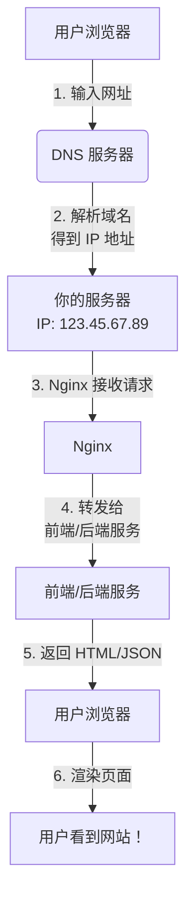
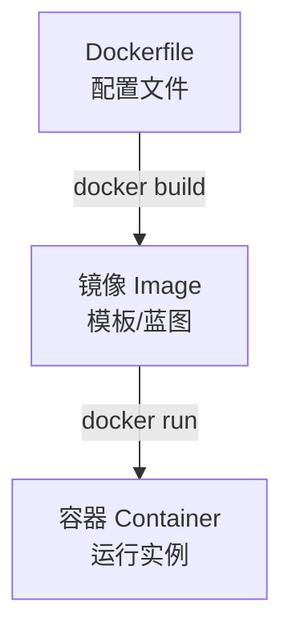

# 第 14 章：项目部署与运维基础

::: important 本章学习目标
- 理解部署的基本概念和演进历史
- **重点掌握独立服务器配置**（Linux、Nginx、systemd）
- 学习 Docker 容器化技术
- 了解 CI/CD 自动化部署
- 入门 Kubernetes 容器编排
- 🎉 **成果：网站上线了！发给朋友看！**
:::

终于到了最激动人心的时刻——把你的网站部署到互联网上，让全世界都能访问！

::: warning 超无聊内容警告
本章内容较多，如果你不想看全部内容，可以跳到[独立服务器部署实战](#_14-3-独立服务器部署实战)或者[免费云平台快速部署](#_14-6-免费云平台快速部署)部分，直接学习如何在一台服务器上部署你的博客系统。
:::

::: tip 本章核心理念
免费云平台虽然方便，但**掌握独立服务器配置能力才是真正理解 Web 服务运作原理的关键**。这是理解所有云服务的基础！
:::

---

## 14.1 部署基础概念

### 14.1.1 什么是部署？

简单来说，**部署就是把你开发好的代码放到一台能被互联网访问的服务器上运行**。

**开发环境 vs 生产环境：**

| 对比项 | 开发环境 | 生产环境 |
|--------|----------|----------|
| 地点 | 你的电脑 | 云服务器 |
| 访问者 | 只有你 | 全世界 |
| 数据 | 测试数据 | 真实数据 |
| 性能要求 | 随便 | 必须稳定 |
| 安全要求 | 不重要 | 非常重要 |

**部署的目标：**
- **可访问**：用户能通过网址打开你的网站
- **稳定**：7×24 小时不宕机
- **安全**：防止攻击、保护用户数据
- **可扩展**：用户增多时能扛住

::: info 历史趣事：互联网是如何诞生的
1969 年，美国国防部的 ARPANET 项目诞生，最初只连接了 4 台计算机。第一条消息是 "LOGIN"，但传到第二个字母 "G" 时系统就崩溃了——这是人类第一次"网络崩溃"！

到了 1991 年，Tim Berners-Lee 在 CERN 发明了万维网（WWW），写下了第一个网页。他本可以申请专利成为亿万富翁，但他选择将 WWW 技术完全免费开放给全世界。

如今你能在浏览器里输入网址访问任何网站，都要感谢这位"不想赚钱"的科学家。
:::

### 14.1.2 你的代码是如何被访问到的？

当用户在浏览器输入 `https://yourblog.com` 时，发生了什么？

::: tip 配色方案说明
这个流程图使用了**双模式友好的配色方案**：
- **浅色背景 + 深色边框和文字**：确保在白天模式下清晰可见
- **柔和的背景色**：避免在暗色模式下过于刺眼
- **高对比度文字**：在各种背景下都能保持可读性

这种设计确保了无论用户使用什么主题，流程图都能清晰展示！
:::



### 14.1.3 部署方式演进史

| 时代 | 方式 | 特点 | 代表 |
|------|------|------|------|
| 1990s | 物理服务器 | 买服务器放机房 | 自建机房 |
| 2000s | 虚拟机（VM） | 一台机器虚拟成多台 | VMware |
| 2010s | 容器化（Docker） | 更轻量的隔离 | Docker |
| 2015+ | 容器编排（K8s） | 大规模容器管理 | Kubernetes |
| 2018+ | Serverless | 无需管理服务器 | AWS Lambda |

::: info 历史趣事：从机房到云端
2006 年，亚马逊推出 AWS EC2，开创了"云计算"时代。在此之前，创业公司要上线服务得先买服务器、找机房、拉网线、装系统...

Netflix 是 AWS 最著名的客户之一。2008 年他们的数据中心着火，导致 3 天无法发货 DVD（那时还是 DVD 租赁业务）。这次事故让他们下定决心迁移到云端。如今 Netflix 是全球最大的云服务用户之一，高峰期占北美互联网流量的 15%！
:::

### 14.1.4 部署方式对比

| 方式 | 优点 | 缺点 | 适合场景 | 费用 |
|------|------|------|---------|------|
| 独立服务器 | 完全可控、深入理解 | 运维复杂 | **学习首选** | 按需 |
| PaaS 平台 | 简单快速 | 灵活性低 | 快速验证 | 免费起步 |
| 容器部署 | 环境一致 | 学习成本 | 团队协作 | 按需 |
| Serverless | 免运维 | 冷启动、调试难 | 轻量 API | 按调用 |

## 14.2 Linux 服务器基础

::: important 🔥 核心章节
这是理解所有云服务和运维的基础！无论你用什么云平台，底层都是 Linux 服务器。
:::

::: tip 历史趣事：Linux 的诞生的传奇故事
1991 年，21 岁的芬兰大学生 Linus Torvalds 在邮件列表发了一条消息："我在做一个（免费的）操作系统，只是个人爱好，不会像 GNU 那样庞大和专业。"

而这个过程堪称传奇，Linus 在这之后收到了全球程序员对 Linux 的贡献，迅速发展壮大，最终形成了今天的 Linux 内核。

他当时绝对想不到，这个"个人爱好"会成为运行在全球 90% 以上服务器上的操作系统。如今你访问的几乎所有网站——Google、Facebook、淘宝、微信——背后都是 Linux 服务器。

Android 手机？底层也是 Linux。你的 WiFi 路由器？大概率也是 Linux。连 SpaceX 的火箭和特斯拉的汽车都运行 Linux！
:::

::: tip 为什么被取名为 Linux？
Linus Torvalds 最初想把他的操作系统命名为 "Freax"（free + freak + x），但他的朋友 Ari Lemmke 在 FTP 服务器上创建了一个目录，错把它命名为 "linux"（Linus 的 Unix 版本）。Linus 觉得这个名字听起来不错，就沿用了下来。
:::

**由于这一章内容较多，且内容较为枯燥，你可以点击下方的展开按钮进行选择性阅读：**

当然，推荐你先了解 Linux + [命令行](../essential/command-line/) 基础，再进行实战部署。

<details>
<summary>🔥 点击展开 Linux 服务器基础</summary>

### 14.2.1 连接远程服务器

**SSH（Secure Shell）** 是连接远程服务器的标准方式：

```bash
# 最基础的连接方式
ssh username@your-server-ip

# 例如
ssh root@123.45.67.89

# 使用密钥登录（更安全，推荐）
ssh -i ~/.ssh/my_key username@your-server-ip

# 指定端口（默认 22）
ssh -p 2222 username@your-server-ip
```

**首次连接会看到：**

```
The authenticity of host '123.45.67.89' can't be established.
ED25519 key fingerprint is SHA256:xxx...
Are you sure you want to continue connecting (yes/no)?
```

输入 `yes` 确认，然后输入密码即可。

### 14.2.2 Linux 基础命令

**文件操作：**

```bash
# 列出文件
ls              # 简单列出
ls -la          # 详细列出（含隐藏文件）
ls -lh          # 人性化显示大小

# 切换目录
cd /home/user   # 切换到指定目录
cd ..           # 上一级目录
cd ~            # 回到家目录
pwd             # 显示当前目录

# 创建/删除
mkdir mydir              # 创建目录
mkdir -p path/to/dir     # 递归创建
touch file.txt           # 创建空文件
rm file.txt              # 删除文件
rm -rf dir               # 删除目录（危险！）

# 复制/移动
cp file1 file2           # 复制文件
cp -r dir1 dir2          # 复制目录
mv old new               # 移动/重命名
```

::: warning rm -rf 的危险性
`rm -rf /` 会删除整个系统！永远不要执行这个命令。

在执行 `rm -rf` 之前，先用 `ls` 确认你要删除的是什么。
:::

**文件查看：**

```bash
cat file.txt         # 显示整个文件
head -n 20 file.txt  # 显示前 20 行
tail -n 20 file.txt  # 显示后 20 行
tail -f file.txt     # 实时追踪文件（看日志神器！）
less file.txt        # 分页查看（按 q 退出）
```

**系统信息：**

```bash
# 磁盘
df -h            # 查看磁盘使用情况
du -sh *         # 当前目录各文件/文件夹大小

# 内存
free -h          # 查看内存使用

# CPU 和进程
top              # 实时进程监控（按 q 退出）
htop             # 更好看的 top（需要安装）

# 系统信息
uname -a         # 系统版本
lsb_release -a   # 发行版信息
uptime           # 运行时间
```

**网络相关：**

```bash
# HTTP 请求
curl https://api.example.com    # GET 请求
curl -X POST -d "data" url      # POST 请求

# 下载文件
wget https://example.com/file.zip

# 查看端口
netstat -tlnp    # 查看监听的端口
ss -tlnp         # 更现代的命令
lsof -i :8000    # 查看占用 8000 端口的进程

# 网络连通性
ping google.com
```

### 14.2.3 用户与权限

**用户管理：**

```bash
# 创建用户
sudo useradd -m -s /bin/bash newuser  # -m 创建家目录
sudo passwd newuser                    # 设置密码

# 添加到 sudo 组（获得管理员权限）
sudo usermod -aG sudo newuser

# 切换用户
su - newuser

# 查看当前用户
whoami
```

**文件权限：**

```bash
# 查看权限
ls -la
# 输出示例：-rwxr-xr-x 1 user group 1234 Dec 25 10:00 file.txt

# 权限含义
# -rwxr-xr-x
# │├─┤├─┤├─┤
# │ │  │  └── 其他用户：r-x（读、执行）
# │ │  └───── 同组用户：r-x（读、执行）
# │ └──────── 文件所有者：rwx（读、写、执行）
# └────────── 文件类型（- 普通文件，d 目录）
```

**修改权限：**

```bash
# 数字方式
chmod 755 file    # rwxr-xr-x
chmod 644 file    # rw-r--r--
chmod 600 file    # rw-------（只有自己能读写）

# 符号方式
chmod +x file     # 添加执行权限
chmod u+w file    # 给所有者添加写权限

# 修改所有者
chown user:group file
chown -R user:group dir  # 递归修改
```

::: tip 权限数字速记
- **7** = rwx（4+2+1）= 读+写+执行
- **6** = rw-（4+2）= 读+写
- **5** = r-x（4+1）= 读+执行
- **4** = r--（4）= 只读
- **0** = ---（0）= 无权限

常用组合：
- `755`：目录或脚本（所有人可执行）
- `644`：普通文件（所有人可读）
- `600`：私密文件（只有自己能访问）
:::

### 14.2.4 进程与服务管理

**进程管理：**

```bash
# 查看进程
ps aux                    # 查看所有进程
ps aux | grep python      # 搜索包含 python 的进程

# 结束进程
kill PID                  # 正常结束（发送 SIGTERM）
kill -9 PID               # 强制结束（发送 SIGKILL）
pkill python              # 按名字结束进程
killall python            # 结束所有同名进程
```

**systemd 服务管理：**

::: info 历史趣事：systemd 之争
2010 年 systemd 发布时引发了 Linux 社区激烈争论。传统派认为它"太臃肿"，违背了 Unix "做好一件事"的哲学。支持派认为它解决了旧系统的很多问题。

这场"圣战"持续多年，甚至有人创建了 Devuan（去除 systemd 的 Debian 分支）。但最终 systemd 赢了——如今几乎所有主流 Linux 发行版都默认使用它。
:::

```bash
# 服务控制
sudo systemctl start nginx      # 启动服务
sudo systemctl stop nginx       # 停止服务
sudo systemctl restart nginx    # 重启服务
sudo systemctl reload nginx     # 重新加载配置（不中断服务）
sudo systemctl status nginx     # 查看状态

# 开机自启
sudo systemctl enable nginx     # 设置开机自启
sudo systemctl disable nginx    # 取消开机自启

# 查看日志
journalctl -u nginx             # 查看服务日志
journalctl -u nginx -f          # 实时查看
journalctl -u nginx --since "1 hour ago"
```

### 14.2.5 防火墙配置

**UFW（Ubuntu 简化防火墙）：**

```bash
# 启用防火墙
sudo ufw enable

# 查看状态
sudo ufw status
sudo ufw status verbose

# 允许端口
sudo ufw allow 22        # SSH
sudo ufw allow 80        # HTTP
sudo ufw allow 443       # HTTPS
sudo ufw allow 3000      # Node.js 应用

# 删除规则
sudo ufw delete allow 3000

# 只允许特定 IP
sudo ufw allow from 192.168.1.100 to any port 22

# 禁用防火墙
sudo ufw disable
```

::: warning 防火墙注意事项
配置防火墙前，**一定要先允许 SSH 端口**（默认 22），否则你会把自己锁在外面！
:::

</details>

## 14.3 独立服务器部署实战

::: important 🔥 核心实战
这一节将手把手教你在一台全新的服务器上部署整个博客系统。掌握这个流程，你就真正理解了 Web 服务的运作原理！
:::

### 14.3.1 准备服务器

**推荐配置：**
- **CPU**: 1-2 核
- **内存**: 1-2 GB
- **存储**: 20-40 GB SSD
- **系统**: Ubuntu 22.04 LTS

**免费/低价服务器选择：**

| 平台 | 免费额度 | 说明 |
|------|----------|------|
| Oracle Cloud | 永久免费 ARM 实例 | 4核24G内存 |
| AWS 免费套餐 | 12 个月 | t2.micro 实例 |
| Google Cloud | $300 额度 | 90 天有效 |
| Azure 学生 | $100/年 | 需要教育邮箱 |
| 腾讯云/阿里云 | 新人优惠(一般最多一个月免费) | 低至几十元/年(可能有教育优惠) |

### 14.3.2 初始化服务器

拿到服务器后，首先进行安全配置：

```bash
# 1. 连接服务器
ssh root@your-server-ip

# 2. 更新系统
sudo apt update && sudo apt upgrade -y

# 3. 创建部署用户（不要用 root 跑应用）
sudo useradd -m -s /bin/bash deploy
sudo passwd deploy
sudo usermod -aG sudo deploy

# 4. 切换到新用户
su - deploy

# 5. 配置 SSH 密钥登录
mkdir -p ~/.ssh
chmod 700 ~/.ssh

# 在本地电脑生成密钥（如果没有）
# ssh-keygen -t ed25519 -C "your-email@example.com"

# 将本地公钥内容添加到服务器
echo "ssh-ed25519 AAAA... your-email" >> ~/.ssh/authorized_keys
chmod 600 ~/.ssh/authorized_keys
```

**增强 SSH 安全性（可选但推荐）：**

```bash
# 编辑 SSH 配置
sudo vim /etc/ssh/sshd_config

# 修改以下配置：
# PasswordAuthentication no    # 禁用密码登录
# PermitRootLogin no           # 禁止 root 登录
# Port 2222                    # 修改默认端口

# 重启 SSH 服务
sudo systemctl restart sshd
```

**配置防火墙：**

```bash
# 先允许 SSH！
sudo ufw allow 22    # 或者你修改后的端口
sudo ufw allow 80
sudo ufw allow 443
sudo ufw enable
sudo ufw status
```

### 14.3.3 安装必要软件

```bash
# 安装 Node.js（使用 nvm）
curl -o- https://raw.githubusercontent.com/nvm-sh/nvm/v0.39.7/install.sh | bash
source ~/.bashrc
nvm install 20
nvm use 20
node --version  # 验证

# 安装 Python
sudo apt install python3 python3-pip python3-venv -y
python3 --version  # 验证

# 安装 Nginx
sudo apt install nginx -y
sudo systemctl enable nginx
sudo systemctl start nginx
# 访问服务器 IP，应该能看到 Nginx 默认页面

# 安装 Git
sudo apt install git -y

# 安装其他工具
sudo apt install vim curl wget htop -y
```

### 14.3.4 部署后端

```bash
# 1. 克隆项目
cd /home/deploy
git clone https://github.com/yourusername/your-blog.git
cd your-blog/backend

# 2. 创建 Python 虚拟环境
python3 -m venv venv
source venv/bin/activate

# 3. 安装依赖
pip install -r requirements.txt

# 4. 配置环境变量
cp .env.example .env
vim .env
# 修改 SECRET_KEY、DATABASE_URL 等配置

# 5. 初始化数据库
python -c "from app.core.database import init_db; init_db()"

# 6. 测试运行
uvicorn app.main:app --host 127.0.0.1 --port 8000
# Ctrl+C 停止
```

**创建 systemd 服务：**

```bash
sudo vim /etc/systemd/system/blog-backend.service
```

```ini
[Unit]
Description=Blog Backend API
After=network.target

[Service]
User=deploy
Group=deploy
WorkingDirectory=/home/deploy/your-blog/backend
Environment="PATH=/home/deploy/your-blog/backend/venv/bin"
ExecStart=/home/deploy/your-blog/backend/venv/bin/uvicorn app.main:app --host 127.0.0.1 --port 8000
Restart=always
RestartSec=3

[Install]
WantedBy=multi-user.target
```

```bash
# 启动服务
sudo systemctl daemon-reload
sudo systemctl enable blog-backend
sudo systemctl start blog-backend

# 检查状态
sudo systemctl status blog-backend

# 查看日志
journalctl -u blog-backend -f
```

### 14.3.5 部署前端

```bash
# 1. 进入前端目录
cd /home/deploy/your-blog/frontend

# 2. 安装依赖
npm install

# 3. 配置环境变量
cp .env.example .env.production
vim .env.production
# 设置 API_BASE=https://yourdomain.com/api

# 4. 构建
npm run build

# 5. 测试运行
node .output/server/index.mjs
# Ctrl+C 停止
```

**创建 systemd 服务：**

```bash
sudo vim /etc/systemd/system/blog-frontend.service
```

```ini
[Unit]
Description=Blog Frontend
After=network.target

[Service]
User=deploy
Group=deploy
WorkingDirectory=/home/deploy/your-blog/frontend
ExecStart=/home/deploy/.nvm/versions/node/v20.18.0/bin/node .output/server/index.mjs
Restart=always
RestartSec=3
Environment=NODE_ENV=production

[Install]
WantedBy=multi-user.target
```

```bash
# 启动服务
sudo systemctl daemon-reload
sudo systemctl enable blog-frontend
sudo systemctl start blog-frontend
sudo systemctl status blog-frontend
```

### 14.3.6 配置 Nginx 反向代理

```bash
sudo vim /etc/nginx/sites-available/blog
```

```nginx
server {
    listen 80;
    server_name yourdomain.com www.yourdomain.com;

    # 前端
    location / {
        proxy_pass http://127.0.0.1:3000;
        proxy_http_version 1.1;
        proxy_set_header Upgrade $http_upgrade;
        proxy_set_header Connection 'upgrade';
        proxy_set_header Host $host;
        proxy_set_header X-Real-IP $remote_addr;
        proxy_set_header X-Forwarded-For $proxy_add_x_forwarded_for;
        proxy_set_header X-Forwarded-Proto $scheme;
        proxy_cache_bypass $http_upgrade;
    }

    # 后端 API
    location /api {
        proxy_pass http://127.0.0.1:8000;
        proxy_set_header Host $host;
        proxy_set_header X-Real-IP $remote_addr;
        proxy_set_header X-Forwarded-For $proxy_add_x_forwarded_for;
        proxy_set_header X-Forwarded-Proto $scheme;
    }

    # 静态文件缓存
    location ~* \.(js|css|png|jpg|jpeg|gif|ico|svg|woff|woff2)$ {
        proxy_pass http://127.0.0.1:3000;
        expires 1y;
        add_header Cache-Control "public, immutable";
    }

    # 安全头
    add_header X-Frame-Options "SAMEORIGIN" always;
    add_header X-Content-Type-Options "nosniff" always;
}
```

```bash
# 启用站点
sudo ln -s /etc/nginx/sites-available/blog /etc/nginx/sites-enabled/

# 删除默认站点（可选）
sudo rm /etc/nginx/sites-enabled/default

# 测试配置
sudo nginx -t

# 重载配置
sudo systemctl reload nginx
```

现在访问 `http://yourdomain.com` 应该能看到你的博客了！

### 14.3.7 配置 HTTPS（Let's Encrypt）

::: info 历史趣事：HTTPS 的普及之路
2014 年以前，HTTPS 证书很贵（几百到几千美元/年），只有银行和大公司才用。普通网站都是 HTTP 明文传输——你的密码可能被任何中间人看到！

2014 年，几个互联网理想主义者成立了 Let's Encrypt 项目，目标是"让所有网站都能免费使用 HTTPS"。2016 年正式上线后，短短几年内签发了超过 10 亿张证书。

如今 Chrome 会把没有 HTTPS 的网站标记为"不安全"，HTTPS 已成为标配。这一切都要感谢 Let's Encrypt 的免费证书。
:::

```bash
# 安装 Certbot
sudo apt install certbot python3-certbot-nginx -y

# 申请证书（自动配置 Nginx）
sudo certbot --nginx -d yourdomain.com -d www.yourdomain.com

# 按提示操作，输入邮箱、同意条款

# 测试自动续期
sudo certbot renew --dry-run
```

Certbot 会自动修改 Nginx 配置，添加 SSL 证书和 HTTPS 重定向。证书有效期 90 天，Certbot 会自动续期。

### 14.3.8 部署检查清单

部署完成后，检查以下内容：

- [ ] 网站能通过 HTTPS 访问
- [ ] HTTP 自动跳转到 HTTPS
- [ ] 前端页面正常显示
- [ ] 后端 API 正常响应
- [ ] 登录功能正常
- [ ] 服务开机自启
- [ ] 防火墙已启用

## 14.4 Docker 容器化

::: info 历史趣事：Docker 与集装箱
Docker 的 logo 是一只鲸鱼背着集装箱。这不是巧合——Docker 的核心理念来自航运业的革命。

1950 年代以前，货物装卸靠码头工人一件件搬运，效率低下且容易损坏。1956 年，Malcolm McLean 发明了标准集装箱，货物被装进统一尺寸的箱子，无论里面是什么，装卸方式都一样。这个简单的发明让全球贸易效率提升了数十倍。

Docker 做的是同样的事——把应用和它的所有依赖"打包"进一个标准化的容器。无论在你的电脑、测试服务器还是生产环境，运行方式都一样。**"在我电脑上能跑啊"** 这个经典甩锅理由从此消失。
:::

### 14.4.1 为什么需要 Docker？

**没有 Docker 的痛苦：**
- "在我电脑上能跑，服务器上跑不了"
- Node.js 版本不对、Python 版本不对
- 各种依赖库版本冲突
- 每台服务器都要手动配置环境

**有了 Docker：**
- 一次打包，到处运行
- 环境完全一致
- 快速部署、快速回滚
- 隔离不同应用，互不干扰

### 14.4.2 Docker 基础概念



- **镜像（Image）**：包含应用和所有依赖的只读模板，类似于"安装包"
- **容器（Container）**：镜像的运行实例，类似于"运行中的程序"
- **Dockerfile**：描述如何构建镜像的配置文件

### 14.4.3 安装 Docker

```bash
# Ubuntu 安装 Docker
curl -fsSL https://get.docker.com | sh

# 将当前用户添加到 docker 组（免 sudo）
sudo usermod -aG docker $USER
# 重新登录生效

# 验证安装
docker --version
docker run hello-world
```

### 14.4.4 Dockerfile 编写

**前端 Dockerfile：**

```dockerfile
# frontend/Dockerfile

# 第一阶段：构建
FROM node:20-alpine AS builder
WORKDIR /app

# 复制依赖文件
COPY package*.json ./
RUN npm ci

# 复制源码并构建
COPY . .
RUN npm run build

# 第二阶段：运行（更小的镜像）
FROM node:20-alpine
WORKDIR /app

# 只复制构建产物
COPY --from=builder /app/.output .output

# 非 root 用户运行（安全最佳实践）
RUN addgroup -g 1001 -S nodejs
RUN adduser -S nuxtjs -u 1001
USER nuxtjs

EXPOSE 3000
CMD ["node", ".output/server/index.mjs"]
```

**后端 Dockerfile：**

```dockerfile
# backend/Dockerfile

FROM python:3.11-slim
WORKDIR /app

# 安装依赖
COPY requirements.txt .
RUN pip install --no-cache-dir -r requirements.txt

# 复制代码
COPY . .

# 创建非 root 用户
RUN useradd -m -u 1001 appuser
RUN chown -R appuser:appuser /app
USER appuser

EXPOSE 8000
CMD ["uvicorn", "app.main:app", "--host", "0.0.0.0", "--port", "8000"]
```

### 14.4.5 Docker Compose 多容器编排

`docker-compose.yml` 可以同时管理多个容器：

```yaml
# docker-compose.yml

version: '3.8'

services:
  frontend:
    build: ./frontend
    ports:
      - "3000:3000"
    environment:
      - API_BASE=http://backend:8000
    depends_on:
      - backend
    restart: unless-stopped

  backend:
    build: ./backend
    ports:
      - "8000:8000"
    volumes:
      - ./data:/app/data
    environment:
      - DATABASE_URL=sqlite:///./data/blog.db
      - SECRET_KEY=${SECRET_KEY}
    restart: unless-stopped

  # 可选：Nginx 反向代理
  nginx:
    image: nginx:alpine
    ports:
      - "80:80"
      - "443:443"
    volumes:
      - ./nginx.conf:/etc/nginx/nginx.conf:ro
      - ./ssl:/etc/nginx/ssl:ro
    depends_on:
      - frontend
      - backend
    restart: unless-stopped

volumes:
  data:
```

### 14.4.6 常用 Docker 命令

```bash
# 构建镜像
docker build -t myapp:v1 .
docker build -t myapp:v1 -f Dockerfile.prod .  # 指定 Dockerfile

# 运行容器
docker run -d -p 3000:3000 --name myapp myapp:v1
# -d: 后台运行
# -p: 端口映射
# --name: 容器名称

# 查看容器
docker ps                 # 运行中的容器
docker ps -a              # 所有容器（包括停止的）

# 容器操作
docker stop myapp         # 停止
docker start myapp        # 启动
docker restart myapp      # 重启
docker rm myapp           # 删除（需先停止）

# 查看日志
docker logs myapp         # 查看日志
docker logs -f myapp      # 实时查看
docker logs --tail 100 myapp  # 最后 100 行

# 进入容器
docker exec -it myapp sh  # 进入容器 shell

# 镜像管理
docker images             # 列出镜像
docker rmi image_id       # 删除镜像
docker system prune       # 清理无用资源

# Docker Compose
docker-compose up -d      # 启动所有服务
docker-compose down       # 停止并删除
docker-compose logs -f    # 查看所有服务日志
docker-compose ps         # 查看服务状态
docker-compose build      # 重新构建
docker-compose pull       # 拉取最新镜像
```


## 14.5 CI/CD 自动化部署

::: info 历史趣事：从手动部署到自动化
早期的软件发布是这样的：开发者把代码打包成压缩文件，通过 FTP 上传到服务器，然后远程登录服务器，解压、重启服务。如果出问题，就手动回滚到上一个版本。

2006 年，Martin Fowler 写了《持续集成》一文，提出了"代码提交后自动构建、测试、部署"的理念。但真正让 CI/CD 普及的是 2011 年的 Jenkins 和后来的 GitHub Actions（2019）。

如今，大公司每天部署几千次是常态。Amazon 在 2019 年透露他们平均每 11.7 秒就部署一次代码到生产环境！
:::

### 14.5.1 CI/CD 概念

- **CI（Continuous Integration，持续集成）**：代码合并后自动运行测试
- **CD（Continuous Delivery，持续交付）**：测试通过后自动构建可部署的产物
- **CD（Continuous Deployment，持续部署）**：自动部署到生产环境

```
代码提交 → 自动测试 → 自动构建 → 自动部署
   ↑                              ↓
   └────── 发现问题立即修复 ←──────┘
```

### 14.5.2 GitHub Actions 配置

在项目根目录创建 `.github/workflows/deploy.yml`：

```yaml
name: Build and Deploy

on:
  push:
    branches: [main]
  pull_request:
    branches: [main]

jobs:
  # 第一个任务：测试
  test:
    runs-on: ubuntu-latest
    steps:
      - uses: actions/checkout@v4

      # 前端测试
      - name: Setup Node.js
        uses: actions/setup-node@v4
        with:
          node-version: '20'
          cache: 'npm'
          cache-dependency-path: frontend/package-lock.json

      - name: Install and Test Frontend
        working-directory: frontend
        run: |
          npm ci
          npm run lint
          npm run build

      # 后端测试
      - name: Setup Python
        uses: actions/setup-python@v5
        with:
          python-version: '3.11'

      - name: Install and Test Backend
        working-directory: backend
        run: |
          pip install -r requirements.txt
          pip install pytest
          pytest -v

  # 第二个任务：部署（仅 main 分支）
  deploy:
    needs: test
    if: github.ref == 'refs/heads/main' && github.event_name == 'push'
    runs-on: ubuntu-latest

    steps:
      - uses: actions/checkout@v4

      - name: Deploy to Server
        uses: appleboy/ssh-action@v1.0.0
        with:
          host: ${{ secrets.SERVER_HOST }}
          username: ${{ secrets.SERVER_USER }}
          key: ${{ secrets.SSH_PRIVATE_KEY }}
          script: |
            cd /home/deploy/your-blog

            # 拉取最新代码
            git pull origin main

            # 更新后端
            cd backend
            source venv/bin/activate
            pip install -r requirements.txt
            sudo systemctl restart blog-backend

            # 更新前端
            cd ../frontend
            npm install
            npm run build
            sudo systemctl restart blog-frontend

            echo "Deploy completed at $(date)"
```

### 14.5.3 配置 GitHub Secrets

在 GitHub 仓库中配置以下 Secrets（Settings → Secrets and variables → Actions）：

- `SERVER_HOST`：服务器 IP 地址
- `SERVER_USER`：SSH 用户名（如 deploy）
- `SSH_PRIVATE_KEY`：SSH 私钥内容

### 14.5.4 工作流程

配置完成后，每次 push 到 main 分支：

1. GitHub Actions 自动触发
2. 运行前后端测试
3. 测试通过后，SSH 连接到服务器
4. 拉取最新代码、重新构建、重启服务
5. 部署完成！


## 14.6 免费云平台快速部署

如果你暂时不想折腾服务器，可以使用免费云平台快速部署：

### 14.6.1 完全免费的部署方案

| 服务 | 前端 | 后端 | 数据库 | 限制 |
|------|------|------|--------|------|
| Vercel | ✅ 免费 | Serverless | - | 100GB/月流量 |
| Render | ✅ 免费 | ✅ 免费 | PostgreSQL 免费 | 会休眠（15分钟无访问） |
| Fly.io | ✅ 免费 | ✅ 免费 | PostgreSQL 免费 | 3 个小实例 |
| Cloudflare Pages | ✅ 免费 | Workers 免费 | D1 免费 | Workers 有限制 |
| Supabase | - | - | ✅ PostgreSQL 免费 | 500MB 存储 |

### 14.6.2 Vercel + Render 方案（推荐新手）

**Vercel 部署前端：**

1. 注册 [Vercel](https://vercel.com) 账号
2. 点击 "New Project"
3. 导入 GitHub 仓库
4. 选择 `frontend` 目录作为根目录
5. Vercel 会自动检测 Nuxt 项目
6. 点击 "Deploy"

**Render 部署后端：**

1. 注册 [Render](https://render.com) 账号
2. 创建 "New Web Service"
3. 连接 GitHub 仓库
4. 配置：
   - Root Directory: `backend`
   - Build Command: `pip install -r requirements.txt`
   - Start Command: `uvicorn app.main:app --host 0.0.0.0 --port $PORT`
5. 添加环境变量（SECRET_KEY 等）
6. 点击 "Create Web Service"

### 14.6.3 Fly.io 方案（更灵活）

```bash
# 安装 flyctl
curl -L https://fly.io/install.sh | sh

# 登录
fly auth login

# 部署后端
cd backend
fly launch  # 按提示配置
fly deploy

# 部署前端
cd ../frontend
fly launch
fly deploy

# 查看状态
fly status
fly logs
```

## 14.7 Kubernetes 入门

::: caution 高难度警告
Kubernetes 是一个复杂的系统，理解它需要一定的时间和精力。建议只作为了解，不必强制使用，除非你真的需要管理大量容器。
:::

::: info 历史趣事：Kubernetes 的诞生
Google 内部有一个叫 Borg 的系统，从 2003 年开始管理着 Google 全球数百万台服务器上的容器。2014 年，Google 决定将 Borg 的核心理念开源，取名 Kubernetes（希腊语"舵手"的意思，发音 "koo-ber-NET-eez"，简称 K8s——因为 K 和 s 之间有 8 个字母）。

K8s 一经发布就改变了整个行业。如今它已成为容器编排的事实标准，几乎所有云平台都支持。有人说 K8s 是"云原生时代的 Linux"。

有趣的是，K8s 的 logo 是一个七边形舵轮。为什么是七边形？因为 Borg（星际迷航里的外星种族）有七个成员，这是对 Borg 系统的致敬。
:::

### 14.7.1 为什么需要 Kubernetes？

当你有很多容器要管理时：

| 场景 | Docker Compose | Kubernetes |
|------|----------------|------------|
| 容器数量 | 几个到几十个 | 几十到几千个 |
| 服务器数量 | 1 台 | 多台集群 |
| 自动扩缩容 | 不支持 | 支持 |
| 自动故障恢复 | 有限 | 强大 |
| 滚动更新 | 手动 | 自动 |

### 14.7.2 K8s 基础概念

```
Pod          - 最小部署单元（一个或多个容器）
Deployment   - 管理 Pod 的副本数量和更新策略
Service      - 为 Pod 提供稳定的访问地址
Ingress      - 管理外部访问（类似 Nginx）
ConfigMap    - 配置信息
Secret       - 敏感信息（密码、密钥）
Namespace    - 资源隔离
```

### K8s 相关细节

::: details 展开查看 K8s 配置示例,本地学习，监控与日志，以及常用命令
### 14.7.3 K8s 配置示例
```yaml
# deployment.yaml
apiVersion: apps/v1
kind: Deployment
metadata:
  name: blog-backend
spec:
  replicas: 2  # 运行 2 个副本
  selector:
    matchLabels:
      app: blog-backend
  template:
    metadata:
      labels:
        app: blog-backend
    spec:
      containers:
      - name: backend
        image: your-registry/blog-backend:latest
        ports:
        - containerPort: 8000
        env:
        - name: DATABASE_URL
          valueFrom:
            secretKeyRef:
              name: blog-secrets
              key: database-url
        resources:
          requests:
            memory: "128Mi"
            cpu: "100m"
          limits:
            memory: "256Mi"
            cpu: "500m"
---
apiVersion: v1
kind: Service
metadata:
  name: blog-backend
spec:
  selector:
    app: blog-backend
  ports:
  - port: 80
    targetPort: 8000
  type: ClusterIP
```
### 14.7.4 本地学习 K8s

```bash
# 方式 1：Docker Desktop 内置 K8s
# 在 Docker Desktop 设置中启用 Kubernetes

# 方式 2：Minikube
# 安装 Minikube
curl -LO https://storage.googleapis.com/minikube/releases/latest/minikube-linux-amd64
sudo install minikube-linux-amd64 /usr/local/bin/minikube

# 启动集群
minikube start

# 基本命令
kubectl get pods          # 查看 Pod
kubectl get services      # 查看 Service
kubectl apply -f file.yaml  # 应用配置
kubectl logs pod-name     # 查看日志
kubectl describe pod pod-name  # 详细信息
```

## 14.8 监控与日志

### 14.8.1 日志管理

```bash
# systemd 服务日志
journalctl -u blog-backend -f          # 实时查看
journalctl -u blog-backend -n 100      # 最后 100 行
journalctl -u blog-backend --since "1 hour ago"

# Docker 日志
docker logs -f container_id
docker logs --tail 100 container_id

# Nginx 日志
tail -f /var/log/nginx/access.log      # 访问日志
tail -f /var/log/nginx/error.log       # 错误日志
```

### 14.8.2 简单监控脚本

```bash
#!/bin/bash
# /home/deploy/monitor.sh

# 检查服务状态
check_service() {
    if ! systemctl is-active --quiet $1; then
        echo "$(date): $1 is down, restarting..."
        sudo systemctl restart $1
        # 可以添加邮件/微信通知
    fi
}

check_service blog-backend
check_service blog-frontend
check_service nginx

# 检查磁盘空间
DISK_USAGE=$(df -h / | awk 'NR==2 {print $5}' | sed 's/%//')
if [ $DISK_USAGE -gt 80 ]; then
    echo "$(date): Warning! Disk usage is ${DISK_USAGE}%"
fi

# 检查内存
MEM_USAGE=$(free | awk 'NR==2 {printf "%.0f", $3/$2*100}')
if [ $MEM_USAGE -gt 90 ]; then
    echo "$(date): Warning! Memory usage is ${MEM_USAGE}%"
fi
```

```bash
# 添加到 crontab，每 5 分钟检查一次
crontab -e
# 添加：*/5 * * * * /home/deploy/monitor.sh >> /home/deploy/monitor.log 2>&1
```

### 14.8.3 常见问题排查

**服务无法启动：**

```bash
# 查看状态和错误信息
systemctl status blog-backend
journalctl -u blog-backend -n 50
```

**端口被占用：**

```bash
# 查看端口占用
sudo netstat -tlnp | grep 8000
sudo lsof -i :8000

# 结束占用进程
sudo kill -9 PID
```

**内存不足：**

```bash
free -h
top  # 按 M 键按内存排序

# 找出占用内存最多的进程
ps aux --sort=-%mem | head -10
```

**磁盘空间不足：**

```bash
df -h
du -sh /var/log/*

# 清理日志
sudo journalctl --vacuum-time=7d  # 只保留 7 天日志
```
:::


## 14.9 🎓 毕业典礼：课程总结

::: important 🎉 恭喜你完成了整个课程！
这不仅仅是完成了一个教程，更是你全栈开发生涯的**成人礼**。
:::

### 14.9.1 回头看：我们走过的路

还记得第一行代码 `Hello World` 吗？看看你现在走了多远：

- 🌱 **起步 (Ch 0-2)**：从零搭建环境，迈出第一步
- 🏗️ **前端 (Ch 3-6)**：掌握 Vue 3 与 Nuxt，学会组件化思维
- 💾 **数据 (Ch 7)**：驯服 SQLite，理解关系型数据库
- ⚙️ **核心 (Ch 8-9)**：实现文章发布与用户认证，打通前后端
- 🛡️ **进阶 (Ch 10-11)**：构建权限系统，开发评论插件
- 🎨 **打磨 (Ch 12-13)**：精修样式，优化性能，规范代码
- 🚀 **上线 (Ch 14)**：配置服务器，Docker 容器化，自动化部署

### 14.9.2 你的全栈技能树

你现在已经点亮了以下技能点：

| 领域 | 掌握的技术栈 | 核心能力 |
|------|------------|----------|
| **前端** 🎨 | Nuxt.js 3, Vue 3, Tailwind CSS | 组件化开发、响应式设计、状态管理 |
| **后端** ⚡ | FastAPI, Python, Pydantic | 异步编程、RESTful API 设计、数据验证 |
| **数据库** 💾 | SQLite, SQLAlchemy ORM | 数据库建模、SQL 查询优化、迁移管理 |
| **安全** 🔒 | JWT, bcrypt, RBAC | 身份认证、密码加密、权限控制 |
| **运维** ☁️ | Linux, Docker, Nginx, CI/CD | 服务器管理、容器化部署、自动化流程 |
| **工程化** 🛠️ | Git, ESLint, Prettier | 代码规范、版本控制、项目结构设计 |


## 14.10 🚀 星辰大海：从博客出发

::: tip  举一反三
博客系统是全栈开发的"Hello World"，它包含了 Web 开发 80% 的核心概念。掌握了它，你就能构建几乎任何类型的 Web 应用！
:::

### 14.10.1 万变不离其宗：核心模式迁移

你看似在写博客，其实是在写所有系统：

| 博客系统 | 电商系统 🛍️ | 社交平台 📱 | SaaS 工具 📊 | 核心本质 |
|---------|------------|------------|------------|----------|
| **文章** | 商品 | 帖子/动态 | 文档/任务 | **资源 (Resource)** |
| **评论** | 商品评价 | 互动/回复 | 协作/备注 | **关联数据** |
| **用户** | 买家/卖家 | 关注/粉丝 | 团队/成员 | **认证与授权** |
| **分类/标签** | 商品类目 | 话题/圈子 | 项目/空间 | **数据组织** |

### 14.10.2 技能树点亮计划

下一步学什么？这里有一份**进阶藏宝图**：

- **数据库进阶** 🗄️
  - **PostgreSQL**：更强大的关系型数据库（生产环境首选）
  - **Redis**：缓存、会话存储、简单的消息队列
  - **MongoDB**：文档型数据库，适合非结构化数据

- **后端进阶** 🔙
  - **微服务架构**：将单体应用拆分为独立服务
  - **GraphQL**：比 REST 更灵活的 API 查询语言
  - **WebSocket**：实现实时聊天、通知推送

- **前端进阶** 🖼️
  - **TypeScript**：给 JavaScript 加上类型系统的翅膀（强烈推荐！）
  - **Pinia 深入**：处理更复杂的全局状态
  - **测试**：Vitest (单元测试) + Cypress (端到端测试)

- **运维进阶** 🚢
  - **Kubernetes (K8s)**：驾驭大规模容器集群
  - **监控告警**：Prometheus + Grafana，给系统装上仪表盘
  - **日志聚合**：ELK Stack，在大海捞针中找到 Bug

### 14.10.3 练手项目推荐 (Level Up!)

不要停下来，用新项目巩固你的技能：

**Level 1：改造博客 (炼气期)** ⭐
- [ ] 添加全文搜索 (Elasticsearch 或简单的 SQL Like)
- [ ] 实现文章自动保存草稿
- [ ] 添加文章版本历史 (Undo/Redo)
- [ ] 支持 Markdown 图片拖拽上传

**Level 2：新项目尝试 (筑基期)** ⭐⭐
- [ ] **在线书签管理器**：抓取网页标题和图标，分类管理
- [ ] **个人财务记账**：图表可视化支出，预算管理
- [ ] **TODO 任务管理**：拖拽排序，看板视图 (类似 Trello)
- [ ] **短链接生成器**：高并发读写的典型场景

**Level 3：挑战复杂系统 (金丹期)** ⭐⭐⭐
- [ ] **在线教育平台**：视频流媒体、课程购买、进度追踪
- [ ] **简易电商系统**：购物车、订单状态机、支付对接
- [ ] **即时通讯 (IM)**：WebSocket 实时聊天、群组、消息回执
- [ ] **低代码平台**：拖拽生成页面 (前端复杂度的巅峰)

### 14.10.4 开发者生存指南

- **📖 读官方文档**：永远是第一手、最准确的资料（不要只看二手教程）。
- **🐙 逛 GitHub**：阅读优秀开源项目的源码，看看大牛怎么写代码。
- **✍️ 写技术博客**：费曼学习法——能教会别人，才算真正学会。
- **🛠️ 动手造轮子**：尝试自己写一个简单的 Web 框架或 ORM，理解底层原理。

## 14.11 小结

::: important 🎉 恭喜你完成了整个全栈课程！
你现在已经：
- ✅ 掌握了前端开发（Nuxt + Vue）
- ✅ 掌握了后端开发（FastAPI + Python）
- ✅ 理解了前后端分离架构
- ✅ 实现了一个完整的博客系统
- ✅ 学会了服务器配置和部署
- ✅ 了解了 Docker 和 CI/CD

**你已经是一名全栈开发者了！**
:::

---

::: tip 致读者
恭喜你完成了整个课程！🎉

编程是一门需要持续学习的技能。技术在不断进步，但核心原理是相通的——你已经掌握了最重要的基础。

记住：**最好的学习方式是动手做项目**。不要等到"学完"才开始——永远不会有"学完"的那一天。

保持好奇心，享受创造的乐趣！

**Happy coding!** 🚀
:::

<CTASection title="CONTINUE THE JOURNEY！" 
    description="你已经掌握了全栈开发的核心技能，接下来可以尝试构建更多有趣的项目，探索更深层次的技术领域！" 
    buttonText="Back To Home" 
    buttonLink="/" />