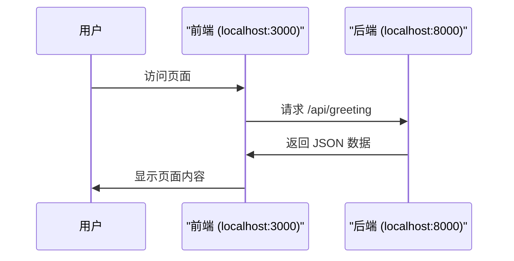

# 第 3 章：第一个全栈页面

::: important 本章学习目标
- 创建 Nuxt 前端项目
- 创建 FastAPI 后端项目
- 前端显示 Hello World 页面
- 后端返回 Hello World API
- 🎉 **重点：前端调用后端 API，显示后端返回的数据！**
:::

终于到激动人心的时刻了！这一章我们要同时创建前端和后端项目，然后让它们"对话"起来。

::: tip 本章结束后你会得到什么
一个页面，上面显示的文字是从后端 API 获取的——这就是"全栈"的第一步！
:::

---

## 3.1 创建项目目录

首先，找一个你喜欢的位置，创建项目文件夹：

```bash
# 创建项目目录
mkdir personal-website
cd personal-website
# 这里的这个目录名字你可以改成你喜欢的名字

# 初始化 Git（养成好习惯）
git init
```

我们的项目结构会是这样：

```
personal-website/
├── frontend/    # 前端项目（Nuxt）
├── backend/     # 后端项目（FastAPI）
└── .gitignore
```

---

## 3.2 创建前端项目（Nuxt）

::: tip 官方文档
[Nuxt 官方文档](https://nuxtjs.org.cn/) - 后面用到什么我们会讲什么
:::

### 3.2.1 初始化 Nuxt 项目

在项目根目录执行：

```bash
pnpm create nuxt@latest frontend
```

安装过程中会问你几个问题：

```bash
# 使用什么包管理器？选 pnpm
✔ Which package manager would you like to use?
› pnpm

# 是否初始化 Git？选 No（我们已经在根目录初始化过了）
✔ Initialize a git repository?
› No

# 是否安装官方模块？推荐选 ESLint 和 Nuxt UI
✔ Would you like to install any of the official modules?
› @nuxt/eslint, @nuxt/ui
```

### 3.2.2 启动前端开发服务器

```bash
cd frontend
pnpm run dev -- -o
```

浏览器会自动打开 `http://localhost:3000`，你应该能看到 Nuxt 的欢迎页面！

::: warning 看到页面了吗？
如果能看到页面，说明前端项目创建成功。先不要关闭这个终端，我们等下还要用。
:::

---

## 3.3 创建后端项目（FastAPI）

::: tip 官方文档
[FastAPI 官方文档](https://fastapi.tiangolo.com/zh/) - 同样，后面用到什么我们会讲什么
:::

### 3.3.1 初始化后端项目

**打开一个新的终端**（保持前端终端运行），回到项目根目录：

```bash
cd personal-website  # 回到项目根目录
mkdir backend
cd backend

# 用 PDM 初始化项目
pdm init
```

初始化过程中的选项：

```bash
# 选择 Python 版本（选你安装的那个就行）
Please enter the Python interpreter to use
› 选择你的 Python

# 项目名称，直接回车用默认值
Project name (backend):
› 直接回车

# 项目版本，直接回车
Project version (0.1.0):
› 直接回车

# 是否要构建项目？选 Yes
Do you want to build this project for distribution?
› y

# 后面的选项都直接回车用默认值就行
```

::: warning 注意事项
由于 pdm 会自动创建一个 .git 文件夹，如果你在根目录已经初始化过 git 仓库，这里会不会提示错误。如果出现这种情况，可以删除 `backend/.git` 文件夹，这不会影响到根目录的 git 仓库。
:::

### 3.3.2 安装 FastAPI 依赖

```bash
pdm add fastapi
pdm add uvicorn
```

::: info 这俩是什么？
- **fastapi**：Web 框架，用来写 API
- **uvicorn**：Web 服务器，用来运行 FastAPI 应用
:::

### 3.3.3 编写第一个 API

在 `backend/src/backend/` 目录下，编辑 `__init__.py` 文件：

```python
from fastapi import FastAPI

app = FastAPI()

@app.get("/")
async def root():
    return {"message": "Hello World!"}

@app.get("/api/greeting")
async def greeting():
    return {"text": "你好，这是来自后端的问候！"}
```

### 3.3.4 启动后端开发服务器

```bash
pdm run uvicorn src.backend:app --reload --port 8000
```

打开浏览器访问：
- `http://localhost:8000` - 应该看到 `{"message": "Hello World!"}`
- `http://localhost:8000/api/greeting` - 应该看到 `{"text": "你好，这是来自后端的问候！"}`

::: tip FastAPI 自带文档页面
访问 `http://localhost:8000/docs`，你会看到一个漂亮的 API 文档页面！

这是 FastAPI 自动生成的，可以直接在页面上测试 API。还有另一个风格的文档在 `/redoc`。
:::

---

## 3.4 让前端调用后端 API

::: important 这是本章的重点！
到目前为止，前端和后端是各自独立运行的。现在我们要让前端去调用后端的 API，并把返回的数据显示在页面上。
:::

### 3.4.1 什么是 JSON？

::: info 先解释一个概念
你刚才访问 `http://localhost:8000/api/greeting` 看到的 `{"text": "你好，这是来自后端的问候！"}` 就是 **JSON** 格式。

JSON 是前后端通信的"通用语言"，长这样：
```json
{
  "name": "张三",
  "age": 18,
  "hobbies": ["编程", "游戏", "音乐"]
}
```

就是用大括号包裹的键值对，前端和后端都能理解。
:::

### 3.4.2 配置跨域（让前端能访问后端）

::: warning 为什么需要这步？
浏览器有个安全机制叫"同源策略"，默认不允许 `localhost:3000`（前端）访问 `localhost:8000`（后端）。

我们需要在后端配置一下，告诉浏览器"没关系，让它访问"。
:::

修改 `backend/src/backend/__init__.py`：

```python
from fastapi import FastAPI
from fastapi.middleware.cors import CORSMiddleware

app = FastAPI()

# 配置跨域
app.add_middleware(
    CORSMiddleware,
    allow_origins=["http://localhost:3000"],  # 允许前端地址
    allow_credentials=True,
    allow_methods=["*"],
    allow_headers=["*"],
)

@app.get("/")
async def root():
    return {"message": "Hello World!"}

@app.get("/api/greeting")
async def greeting():
    return {"text": "你好，这是来自后端的问候！"}
```

保存后，uvicorn 会自动重新加载（因为我们用了 `--reload` 参数）。

### 3.4.3 前端调用后端 API

现在回到前端项目，创建一个新页面来显示后端数据。

在 `frontend/app/` 目录下，创建 `pages` 目录（如果不存在），然后创建 `index.vue`：

```vue
<template>
  <div class="container">
    <h1 class="title">🎉 我的第一个全栈页面</h1>

    <!-- 显示后端返回的数据 -->
    <div v-if="pending">加载中...</div>
    <div v-else-if="error">出错了：{{ error.message }}</div>
    <div v-else class="greeting">
      {{ data?.text }}
    </div>

    <p class="hint">👆 这段文字是从后端 API 获取的！</p>
  </div>
</template>

<script setup>
// 调用后端 API
const { data, pending, error } = await useFetch('http://localhost:8000/api/greeting')
</script>

<style scoped>
.container {
  display: flex;
  flex-direction: column;
  align-items: center;
  justify-content: center;
  min-height: 100vh;
  font-family: system-ui, sans-serif;
}

.title {
  font-size: 2.5rem;
  margin-bottom: 2rem;
}

.greeting {
  font-size: 1.5rem;
  padding: 1rem 2rem;
  background: linear-gradient(135deg, #667eea 0%, #764ba2 100%);
  color: white;
  border-radius: 1rem;
  margin-bottom: 1rem;
}

.hint {
  color: #666;
  font-size: 0.9rem;
}
</style>
```

同时，把 `frontend/app/app.vue` 改成：

```vue
<template>
  <div>
    <NuxtPage />
  </div>
</template>
```

### 3.4.4 查看成果

确保前端和后端都在运行，然后访问 `http://localhost:3000`。

你应该能看到：
- 标题："我的第一个全栈页面"
- 一个紫色渐变的方框，里面显示 "你好，这是来自后端的问候！"
- 一行提示文字

::: important 🎉 恭喜！
如果你看到了这个页面，并且方框里显示了后端返回的文字，说明你已经成功创建了第一个全栈应用！

前端发送请求 → 后端处理请求并返回数据 → 前端显示数据

这就是前后端分离的基本工作流程！
:::

---

## 3.5 理解刚才发生了什么



::: tip 关键点
1. **前端**负责展示界面，用 Vue 写页面
2. **后端**负责提供数据，用 FastAPI 写 API
3. **JSON**是它们之间的"通用语言"
4. **useFetch**是 Nuxt 提供的请求工具，帮我们调用 API
:::

---

## 3.6 小结

::: note 本章回顾
- ✅ 创建了 Nuxt 前端项目
- ✅ 创建了 FastAPI 后端项目
- ✅ 后端写了一个返回 JSON 的 API
- ✅ 前端用 `useFetch` 调用了后端 API
- ✅ 页面成功显示了后端返回的数据
:::

::: important 动手练习
试着修改一下：

1. 把后端 API 返回的文字改成你自己的名字
2. 在前端页面上添加更多样式
3. 在后端添加一个新的 API，比如 `/api/time` 返回当前时间

这些小修改能帮你更好地理解前后端是如何配合的。
:::

::: tip 好像有什么问题？
你也许注意到了，到目前为止，好看的界面都是前端做的，后端只是返回了一点数据。

没错！后端的价值在于**数据处理**——用户认证、数据存储、业务逻辑等。现在后端只返回一句固定的话，但后面我们会让它连接数据库、处理用户登录、管理文章内容...

前端的好看 + 后端的实用 = 完整的全栈应用 🎉
:::
